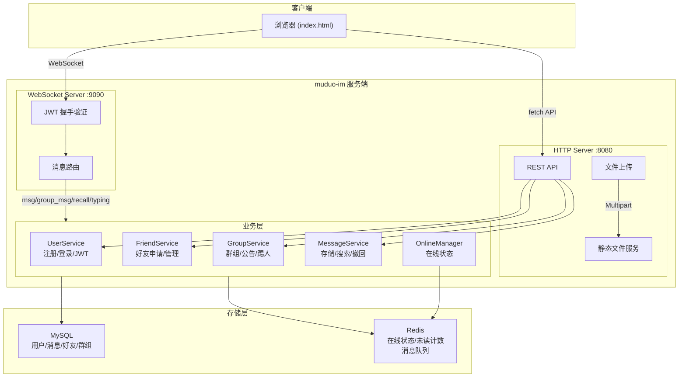
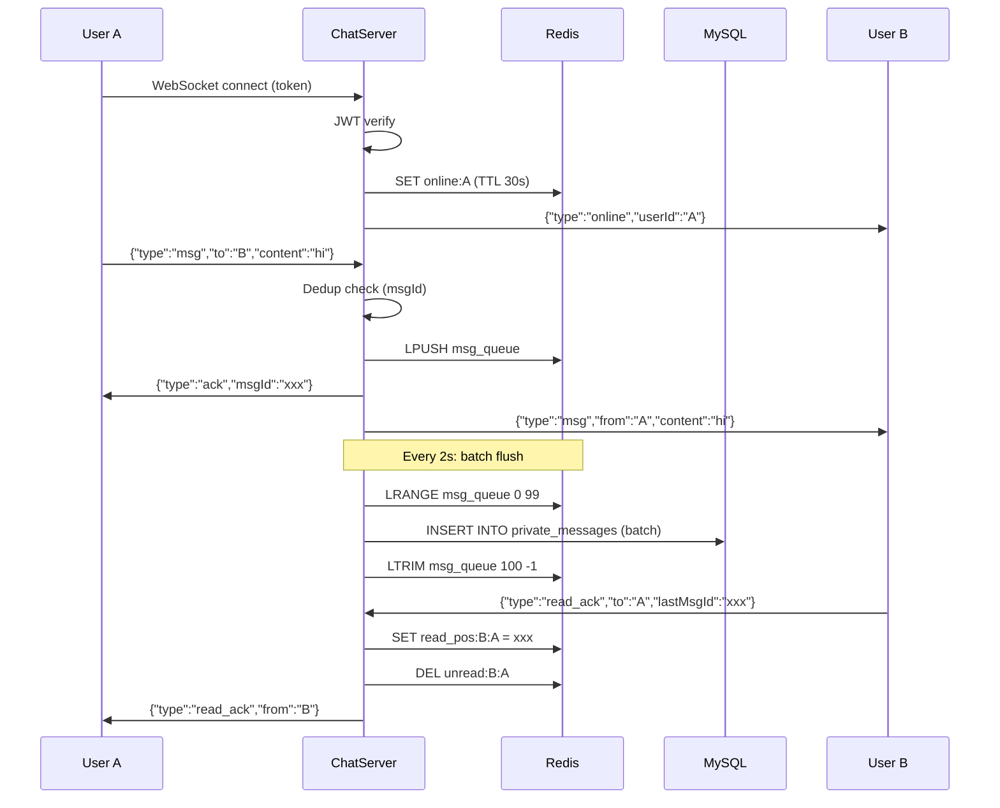

# muduo-im 系统架构

## 整体架构

> 以下 Mermaid 图可在 GitHub 上直接渲染，或使用 [mermaid-cli](https://github.com/mermaid-js/mermaid-cli) (`mmdc -i docs/architecture.mmd -o architecture.svg`) 导出。



<details>
<summary>ASCII 版本（备用）</summary>

```
                        ┌─────────────────────────────────────┐
                        │            muduo-im Server           │
   ┌──────────┐         │                                     │
   │  Browser  │──HTTP──▶│  HttpServer (:8080)                │
   │  / Client │         │    ├── POST /api/register          │
   │           │         │    ├── POST /api/login             │        ┌─────────┐
   │           │         │    ├── GET  /api/friends           │───────▶│  MySQL  │
   │           │         │    ├── POST /api/upload            │        │ muduo_im│
   │           │         │    └── GET  /api/messages/history  │        └─────────┘
   │           │         │                                     │
   │           │──WS────▶│  WebSocketServer (:9090)           │        ┌─────────┐
   │           │         │    ├── msg (私聊)                   │───────▶│  Redis  │
   │           │         │    ├── group_msg (群聊)             │        │ (预留)  │
   │           │         │    ├── file_msg (文件消息)           │        └─────────┘
   │           │         │    ├── recall (消息撤回)            │
   │           │         │    └── read_ack (已读回执)          │
   └──────────┘         └─────────────────────────────────────┘
                                        │
                                        ▼
                        ┌─────────────────────────────────────┐
                        │          Service Layer               │
                        │  UserService    FriendService        │
                        │  GroupService   MessageService       │
                        │  OnlineManager  JWT                  │
                        └─────────────────────────────────────┘
```

</details>

## 线程模型

ChatServer 运行在一个 EventLoop 主线程上，内部包含两个独立的服务：

- **HttpServer** -- 处理 REST API 请求（注册、登录、好友、群组、历史消息、文件上传）
- **WebSocketServer** -- 处理实时消息（私聊、群聊、文件通知、撤回、已读回执）

两个 Server 共享同一个主 EventLoop，IO 线程由 mymuduo-http 框架内部管理。所有 Service 对象由 ChatServer 持有，在回调中直接调用。

OnlineManager 使用 `std::mutex` 保护内部的 `unordered_map<userId, WsSessionPtr>`，保证多线程安全。

## 消息流转（时序图）



## 消息流转（详细）

### 私聊消息

```
发送方              Server                    接收方
  │  {type:"msg",    │                         │
  │   to:"2",        │                         │
  │   content:"hi"}  │                         │
  │─────────────────▶│                         │
  │                  │ 1. savePrivateMessage()  │
  │                  │    INSERT INTO           │
  │                  │    private_messages       │
  │  {type:"ack",   │                         │
  │   msgId:"xxx"}  │                         │
  │◀─────────────────│                         │
  │                  │ 2. getSession(toUser)    │
  │                  │ 3. 如果在线，转发消息     │
  │                  │─────────────────────────▶│
  │                  │  {type:"msg",            │
  │                  │   from:"1", to:"2",      │
  │                  │   content:"hi",          │
  │                  │   msgId:"xxx"}           │
```

### 群聊消息

```
发送方              Server                    群成员A   群成员B
  │  {type:          │                         │         │
  │   "group_msg",   │                         │         │
  │   to:"100",      │                         │         │
  │   content:"hi"}  │                         │         │
  │─────────────────▶│                         │         │
  │                  │ 1. saveGroupMessage()    │         │
  │  {type:"ack"}   │                         │         │
  │◀─────────────────│                         │         │
  │                  │ 2. getMemberIds(100)     │         │
  │                  │ 3. 遍历成员，跳过发送者    │         │
  │                  │    逐个转发给在线成员      │         │
  │                  │────────────────────────▶│         │
  │                  │──────────────────────────────────▶│
```

## 认证流程

```
1. 注册  POST /api/register
         {username, password, nickname}
         → INSERT INTO users (password 经 SHA256+salt 哈希)
         ← {success, userId}

2. 登录  POST /api/login
         {username, password}
         → 查询用户，验证密码哈希
         ← {success, token, userId, nickname}
           token = JWT(HS256, userId, exp=24h)

3. HTTP API 认证
         Header: Authorization: Bearer <token>
         → authFromRequest() 解析 Bearer token
         → JWT.verify() 验证签名 + 过期时间 → userId

4. WebSocket 握手认证
         连接: ws://host:9090/ws?token=<token>
         → setHandshakeValidator() 验证 token
         → 验证通过后 setContext("userId", id)
         → 注册到 OnlineManager
         → 通知好友上线
```

## 数据存储

### MySQL 表

| 表名 | 用途 | 关键索引 |
|------|------|---------|
| `users` | 用户信息 | username UNIQUE |
| `friends` | 好友关系（双向存储） | PRIMARY (user_id, friend_id) |
| `groups` | 群组信息 | owner_id |
| `group_members` | 群成员关系 | PRIMARY (group_id, user_id), idx_user_groups |
| `private_messages` | 私聊消息 | idx_chat (from, to, time), idx_inbox (to, time) |
| `group_messages` | 群聊消息 | idx_group_time (group_id, time) |

### Redis（预留）

RedisPool 已初始化连接，当前主要用于未来扩展（缓存在线状态、会话信息等）。在线状态管理目前由内存中的 OnlineManager 完成。

## 文件上传流程

```
1. 客户端  POST /api/upload (multipart/form-data)
           Header: Authorization: Bearer <token>

2. 服务端  MultipartParser 解析 boundary → 提取文件 part
           生成唯一文件名: UUID + 原始扩展名
           保存到 ../uploads/ 目录
           返回 {success, url: "/uploads/xxx.jpg", filename, size}

3. 客户端  通过 WebSocket 发送 file_msg 通知对方
           {type:"file_msg", to:"2", url, filename, fileSize}

4. 服务端  保存消息记录（content 为 JSON 序列化的文件信息）
           转发给接收方

5. 接收方  收到 file_msg，通过 url 下载文件
           文件通过 httpServer_.serveStatic("/uploads", ...) 提供
```
