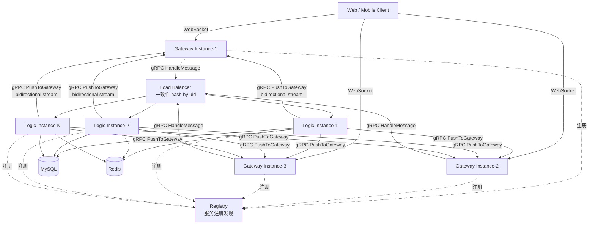
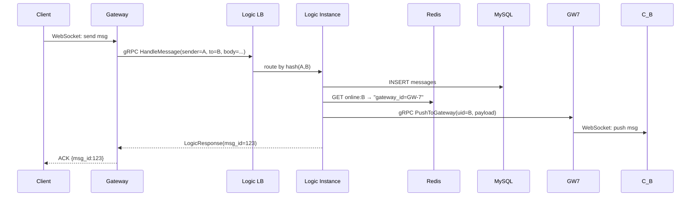
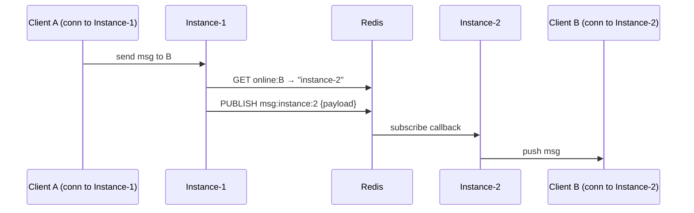
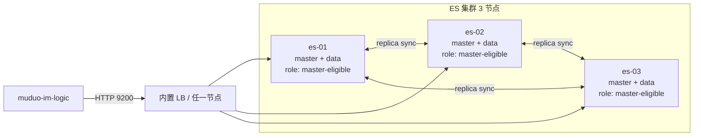
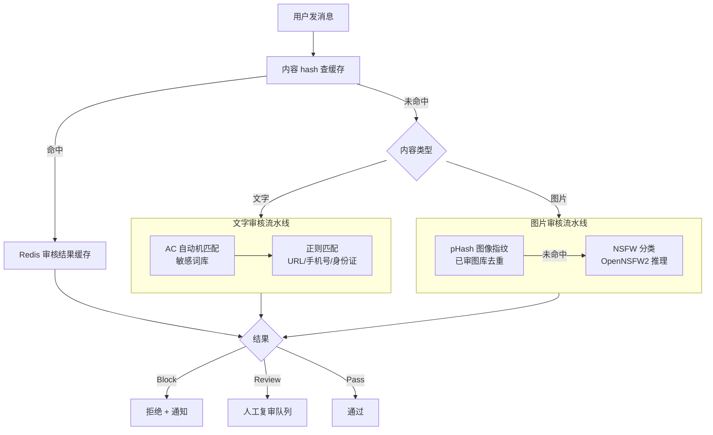
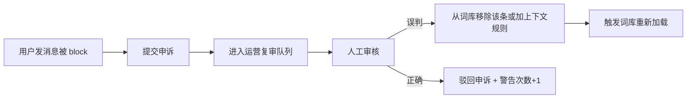

# Plan B · 产品级 MVP 详细实施方案（Big-Tech SOP 标准）

**作者**：chunluren
**日期**：2026-04-18
**版本**：v1.0
**状态**：Draft — 待 review
**关联**：[2026-04-17-acid-durability-improvements.md](./2026-04-17-acid-durability-improvements.md) · [docs/FUTURE_WORK.md](../FUTURE_WORK.md)

---

## 0. 文档说明

本文档是 Plan B（产品级 MVP）的**技术设计文档（TDD）**，严格按大厂研发流程组织。

### 0.1 适用范围

- **目标**：把 muduo-im 从「单实例技术 demo」升级为「分布式、多端、有推送和审核的 MVP」
- **总工作量**：12 周（3 个月）专职
- **阶段**：5 个阶段、**17 个子任务**
- **非目标**：端到端加密、国密、音视频通话（见 Plan C）

### 0.2 SOP 流程总述

每个子任务按以下流程执行：


### 0.3 交付物清单（每个子任务必备）

1. **PRD 片段**：1-2 段需求背景和验收标准
2. **TDD 片段**：架构图 + API + DB schema + 核心代码骨架
3. **任务拆解**：按天的 TODO 列表
4. **测试方案**：单测 + 集成测试 + 性能测试用例
5. **监控指标**：新增的 metric / 日志 / 告警
6. **发布方案**：灰度策略 + 回滚流程
7. **Runbook**：应急处理文档

### 0.4 里程碑总览

**注**：Phase 1.2 采用激进方案（拆 gRPC 进程），Phase 5.2 采用自建方案（AC 自动机 + NSFW 本地推理），总工时比初版增加 4 周。

| 阶段 | 时长 | 累计 | 关键交付 |
|------|------|------|----------|
| Phase 1 基础设施 | **5 周** | W5 | Snowflake、**gRPC 拆分 Gateway/Logic**、跨实例路由、JWT jti |
| Phase 2 消息可靠性 | 2 周 | W7 | ACK 回执、有序性、@ 提醒 |
| Phase 3 多端能力 | 3 周 | W10 | 多端 session、已读同步、设备管理 |
| Phase 4 用户体验 | 2 周 | W12 | 编辑、缩略图、断点续传、**ES 3 节点集群**、Reactions |
| Phase 5 推送与运营 | **3.5 周** | W15.5 | APNs/FCM、**自建内容审核**（AC 自动机 + NSFW）、冷数据归档 |

**总工作量 ~16 周（4 个月）**。并行做 Phase 4/5 可压到 ~13 周。

---

## 1. 工程规范

### 1.1 代码规范

- **C++ 标准**：C++17，使用 GCC 11
- **命名**：类 `PascalCase`、方法 `camelCase`、常量 `kConstantName`、成员变量 `member_`
- **头文件**：header-only 优先（mymuduo-http 既有模式）
- **错误处理**：错误码（避免 exception 跨线程）+ 日志
- **注释**：每个公共类 / 方法带 Doxygen 注释（`@brief`、`@param`、`@return`）

### 1.2 Git 分支策略

- `main`：保护分支，只接 PR merge
- `feat/xxx`：功能分支，每个子任务一个
- `fix/xxx`：bug 修复分支
- `hotfix/xxx`：线上紧急修复
- 提交格式：`<type>(<scope>): <subject>`，type ∈ {feat, fix, docs, refactor, test, chore}

### 1.3 CI 要求（每个 PR 必过）

- 构建：Release + Debug 双模式
- 单元测试：所有测试通过
- ASan / TSan：关键模块开启
- 代码覆盖率：新增代码 ≥ 70%（用 lcov）
- 代码审查：至少 1 人 approve（个人项目自 review，需写 review checklist）

### 1.4 测试分层

| 层 | 目标覆盖率 | 工具 |
|----|------------|------|
| 单元测试 | ≥ 70% | 自写测试框架 + assert |
| 集成测试 | 主流程覆盖 | 自写 + docker-compose 启依赖 |
| E2E 测试 | 关键用户流程 | bash 脚本 + curl |
| 性能测试 | 压到 SLO 边界 | wrk + 自写 ws_bench |
| 混沌测试 | 故障恢复 | 手动 kill 实例 / Redis 等 |

### 1.5 SLO 定义（目标）

| 指标 | 目标 |
|------|------|
| API 可用性（30 天） | ≥ 99.5% |
| 消息端到端延迟 P99 | ≤ 500ms（同城） |
| 消息送达率 | ≥ 99.9% |
| 服务启动时间 | ≤ 10s |
| MTTR（平均恢复时间） | ≤ 15min |

### 1.6 监控告警分级

| 级别 | 触发条件示例 | 响应 |
|------|--------------|------|
| P0（致命） | 服务全挂、数据丢失 | 5 分钟内响应 |
| P1（严重） | 错误率 > 5%、P99 > 2s | 30 分钟内响应 |
| P2（一般） | 磁盘使用 > 80%、慢 SQL 上升 | 2 小时内响应 |
| P3（提示） | 性能轻微下降 | 工作时间处理 |

---

# Phase 1 · 基础设施（3 周 / W1-W3）

**阶段目标**：打地基。分布式 IM 的骨架——全局唯一 ID、网关/逻辑分层、跨实例通信、鉴权强化。

**阶段交付**：多实例部署 + 跨实例消息正常投递 + 全局唯一消息 ID。

---

## 1.1 Snowflake ID 生成器

### 1.1.1 PRD

**背景**：当前消息 ID 用 MySQL AUTO_INCREMENT，单库单点，分库分表或多实例时 ID 会冲突 / 乱序。

**需求**：
- 全局唯一 ID 生成器，64 bit
- 趋势递增（相近时间的 ID 数值接近，B+ 树插入性能好）
- 支持 1024 个 worker（实例）并发
- 单 worker 单 ms 最多生成 4096 个 ID
- 时钟回拨检测与处理

**验收标准**：
- 压测 1 秒生成 1 万 ID，无重复
- 并发 8 线程 30 秒生成，无重复
- 模拟时钟回拨 5ms，系统抛异常并告警

### 1.1.2 TDD

**ID 结构**：

```
| 1 bit symbol | 41 bit timestamp (ms) | 10 bit worker_id | 12 bit sequence |
|--------------|-----------------------|------------------|-----------------|
|      0       |   since custom epoch  |   0 ~ 1023       |   0 ~ 4095      |
```

- **符号位**：0（保证正数）
- **时间戳**：毫秒级 41 bit，基于自定义 epoch（2026-01-01）可用 69 年
- **worker_id**：10 bit，0-1023，通过环境变量 `MUDUO_IM_WORKER_ID` 注入
- **sequence**：12 bit，0-4095，同 ms 内自增

**类设计**：

```cpp
// mymuduo-http/src/util/Snowflake.h
class Snowflake {
public:
    static Snowflake& instance() {
        static Snowflake s;
        return s;
    }

    // 从环境变量初始化 worker_id
    void init(int64_t workerId);

    // 生成下一个 ID
    int64_t nextId();

    // 从 ID 反解时间戳
    static int64_t extractTimestamp(int64_t id);

private:
    Snowflake() = default;

    static constexpr int64_t kEpoch = 1735689600000LL;  // 2026-01-01
    static constexpr int64_t kWorkerIdBits = 10;
    static constexpr int64_t kSequenceBits = 12;
    static constexpr int64_t kMaxWorkerId = (1LL << kWorkerIdBits) - 1;
    static constexpr int64_t kMaxSequence = (1LL << kSequenceBits) - 1;
    static constexpr int64_t kWorkerIdShift = kSequenceBits;
    static constexpr int64_t kTimestampShift = kSequenceBits + kWorkerIdBits;

    int64_t workerId_ = 0;
    int64_t lastTimestamp_ = -1;
    int64_t sequence_ = 0;
    std::mutex mutex_;
};
```

**核心算法**：

```cpp
int64_t Snowflake::nextId() {
    std::lock_guard<std::mutex> lock(mutex_);
    int64_t now = currentMillis();

    if (now < lastTimestamp_) {
        int64_t offset = lastTimestamp_ - now;
        if (offset <= 5) {
            // 回拨 <= 5ms，等待
            std::this_thread::sleep_for(std::chrono::milliseconds(offset));
            now = currentMillis();
        } else {
            // 回拨 > 5ms，拒绝生成（告警 + 抛异常）
            LOG_ERROR_JSON("clock_rollback",
                "offset=" + std::to_string(offset));
            throw std::runtime_error("Clock rollback detected");
        }
    }

    if (now == lastTimestamp_) {
        sequence_ = (sequence_ + 1) & kMaxSequence;
        if (sequence_ == 0) {
            // 当前 ms 序列用完，等下一 ms
            while ((now = currentMillis()) <= lastTimestamp_) {
                // spin
            }
        }
    } else {
        sequence_ = 0;
    }

    lastTimestamp_ = now;
    return ((now - kEpoch) << kTimestampShift)
         | (workerId_ << kWorkerIdShift)
         | sequence_;
}
```

**DB Schema 变更**：

```sql
-- migration_01_snowflake.sql
-- 消息表 id 改为 BIGINT UNSIGNED 不再 AUTO_INCREMENT
ALTER TABLE private_messages MODIFY id BIGINT UNSIGNED NOT NULL;
ALTER TABLE private_messages DROP PRIMARY KEY;
ALTER TABLE private_messages ADD PRIMARY KEY (id);

ALTER TABLE group_messages MODIFY id BIGINT UNSIGNED NOT NULL;
ALTER TABLE group_messages DROP PRIMARY KEY;
ALTER TABLE group_messages ADD PRIMARY KEY (id);

-- 其他表（好友申请、群组等）继续用 AUTO_INCREMENT，不受影响
```

**迁移策略**：
- 新消息直接用 Snowflake
- 旧消息保留 AUTO_INCREMENT 生成的 ID（不冲突，因为 Snowflake 有时间戳 > 旧 ID 最大值）
- 新老 ID 共存期：所有查询按 ID 排序行为一致

### 1.1.3 任务拆解

| Day | 任务 |
|-----|------|
| D1 | 实现 `Snowflake.h` + 单元测试（含并发 8 线程测试） |
| D2 | 时钟回拨处理 + ASan 测试 + 性能测试（1 秒生成 100 万 ID） |
| D3 | 迁移 MessageService::savePrivate/saveGroup + migration SQL + E2E 测试 |

### 1.1.4 测试方案

**单元测试**（`tests/test_snowflake.cpp`）：
- `testBasicUniqueness`：顺序生成 10000 个 ID，无重复
- `testMonotonic`：生成 1000 个 ID，严格递增
- `testConcurrency`：8 线程各生成 10000 个 ID，共 80000 个无重复
- `testClockRollbackSmall`：模拟回拨 3ms，成功生成
- `testClockRollbackLarge`：模拟回拨 100ms，抛异常
- `testWorkerIdBounds`：workerId 1024 抛异常
- `testExtractTimestamp`：反解时间戳正确

**集成测试**：
- 多实例 docker-compose 起 3 个 muduo-im，各 worker_id 不同，并发写消息无冲突

**性能基准**：
- 单线程：≥ 500K ID/s
- 多线程（8 核）：≥ 2M ID/s（有锁竞争，达不到 8x）

### 1.1.5 监控指标

```cpp
Metrics::instance().increment("snowflake_generated_total");
Metrics::instance().increment("snowflake_clock_rollback_total");  // 告警用
Metrics::instance().gauge("snowflake_last_sequence", seq);
```

**告警**：
- P0：`snowflake_clock_rollback_total` 1 分钟 > 0（时钟问题，立刻处理）

### 1.1.6 发布方案

- **灰度**：先在 staging 环境跑 24 小时，观察 rollback 告警
- **开关**：新旧 ID 模式不需要开关，新消息自然用新 ID
- **回滚**：如果 Snowflake 有 bug，恢复用 AUTO_INCREMENT（需要改 MessageService 代码回滚 + 重启）

### 1.1.7 Runbook

**故障：时钟回拨告警**
1. 查看告警实例的 `ntpd` 状态：`timedatectl status`
2. 检查时钟源：`chronyc sources`
3. 如果是 NTP 同步异常，重启 `systemctl restart chronyd`
4. 极端情况：临时下线该实例（K8s 摘流），等时钟恢复后恢复服务
5. 复盘：为何 NTP 未生效？加告警预防

### 1.1.8 风险

- **时钟依赖**：严重依赖系统时钟准确。需要 NTP 保证。
- **worker_id 管理**：生产部署要确保每实例 worker_id 唯一（用 K8s StatefulSet 的 ordinal 或者从 etcd 分配）。

---

## 1.2 Gateway / Logic 分层（激进方案：拆 gRPC 进程）

### 1.2.1 PRD

**背景**：当前 ChatServer 耦合了协议解析、session 管理、业务逻辑。单进程无法独立扩展接入层（长连接）和业务层（RPS 峰值）。

**需求**：
- **拆分成独立进程 + gRPC 通信**：`muduo-im-gateway`（接入层）+ `muduo-im-logic`（业务层）
- Gateway 管长连接 + session + WebSocket 协议；Logic 无状态可水平扩展
- gRPC bidirectional streaming：Logic 主动推送消息给 Gateway
- 服务发现：通过 `registry` 模块（mymuduo-http 内置）或 K8s DNS

**验收标准**：
- 独立部署：Gateway 和 Logic 可独立 scale（3 Gateway + 5 Logic 组合可跑）
- 性能：gRPC 单跳延迟 P99 ≤ 5ms
- 容灾：Logic 挂一个实例后，Gateway 自动切换到其他 Logic 实例
- 测试：既有 E2E 测试 23/23 全绿

**工作量**：3 周（比保守方案多 2 周，收益是真正的分布式架构）

### 1.2.2 TDD

**架构（激进方案）**：



**进程职责拆分**：

| 进程 | 职责 | 状态 | 扩展性 |
|------|------|------|--------|
| **muduo-im-gateway** | WebSocket 接入、session 管理（OnlineManager）、协议编解码、JWT 验证 | **有状态**（持 session） | 每 Pod ~2 万长连接，N 个 Pod |
| **muduo-im-logic** | 业务逻辑（7 个 Service）、数据库读写、消息生成 | **无状态** | 按 RPS 动态扩缩容 |

**gRPC 服务定义**（protobuf）：

```protobuf
// muduo-im/proto/logic.proto
syntax = "proto3";
package muduo_im;

// Gateway 调用 Logic
service LogicService {
  // 单次请求-响应（同步业务：登录、好友申请等）
  rpc HandleMessage(ClientMessage) returns (LogicResponse);

  // 客户端 WebSocket 断开时通知 Logic（清理状态）
  rpc OnClientDisconnect(DisconnectEvent) returns (Ack);
}

// Logic 调用 Gateway
service GatewayService {
  // bidirectional stream：Logic 推消息到 Gateway，Gateway 转给客户端
  // 每个 Gateway 启动时与每个 Logic 建一条 stream，长驻
  rpc PushToGateway(stream PushRequest) returns (stream PushAck);
}

message ClientMessage {
  int64 sender_id = 1;
  string device_id = 2;
  string gateway_id = 3;  // 告诉 Logic "这个请求来自哪个 Gateway"
  string msg_type = 4;    // "msg" / "ack" / "typing" / "group_msg" / ...
  bytes payload = 5;      // JSON-encoded，内部字段
}

message LogicResponse {
  int32 code = 1;         // 0=成功
  string error_msg = 2;
  bytes payload = 3;      // 给客户端的响应（JSON）
}

message DisconnectEvent {
  int64 uid = 1;
  string device_id = 2;
  string gateway_id = 3;
  int64 disconnect_at = 4;
}

message PushRequest {
  int64 uid = 1;
  string device_id = 2;   // "" 表示推给该 uid 所有设备
  string msg_type = 3;
  bytes payload = 4;
}

message PushAck {
  bool delivered = 1;
  string error_msg = 2;
}

message Ack {}
```

**Gateway 核心代码**：

```cpp
// muduo-im-gateway/src/GatewayServer.h
class GatewayServer {
public:
    GatewayServer(const std::string& gatewayId,
                  const std::string& logicAddr,
                  const std::string& registryAddr);

    void start();
    void stop();

private:
    // WebSocket 收到客户端消息 → 调 Logic
    void onClientMessage(const WsSessionPtr& session,
                         const std::string& raw);

    // Logic 的 push stream 数据到 → 找本地 session 推
    void onLogicPush(const PushRequest& req);

    // 维护与每个 Logic 实例的 push stream
    void maintainLogicStreams();

private:
    std::string gatewayId_;
    OnlineManager onlineManager_;           // 本地 session 管理
    std::unique_ptr<LogicClient> logicClient_;  // gRPC 客户端连 Logic
    RegistryClient registry_;
};
```

**Logic 核心代码**：

```cpp
// muduo-im-logic/src/LogicServer.h
class LogicServer final : public LogicService::Service {
public:
    LogicServer(MySQLPool* mysql, RedisPool* redis);

    // gRPC 入口：处理来自 Gateway 的业务消息
    grpc::Status HandleMessage(
        grpc::ServerContext* ctx,
        const ClientMessage* req,
        LogicResponse* resp) override;

    grpc::Status OnClientDisconnect(
        grpc::ServerContext* ctx,
        const DisconnectEvent* req,
        Ack* resp) override;

private:
    // 业务分发：按 msg_type 路由到各 Service
    LogicResponse dispatch(const ClientMessage& msg);

    // 推消息回 Gateway（业务内部调用）
    void pushToUser(int64_t uid, const std::string& deviceId,
                    const PushRequest& req);

private:
    std::unique_ptr<UserService> userService_;
    std::unique_ptr<MessageService> messageService_;
    // ... 其他 Service
    std::unique_ptr<GatewayClientPool> gatewayClients_;  // 连所有 Gateway
};
```

**消息流时序**：



**负载均衡策略**：

| 方向 | 策略 | 实现 |
|------|------|------|
| Gateway → Logic | **一致性 hash by routing_key**（保证消息有序）| gRPC client-side LB + custom picker |
| Logic → Gateway | **按目标 uid 查 Redis `online:{uid}` → 精确路由** | 不走 LB，直接指定 gateway_id |

**服务发现**：

- 使用 mymuduo-http 内置的 `registry` 模块
- 每个 Gateway / Logic 启动时注册：`{service: "gateway", addr: "192.168.1.10:9000", gateway_id: "gw-1"}`
- gRPC 客户端启动时从 registry 拉当前可用实例列表，长轮询更新
- 备选：K8s 部署则用 Kubernetes DNS（StatefulSet）

**部署拓扑（起步）**：

```
Gateway × 3 (StatefulSet, gateway_id = gw-0/1/2)
Logic   × 3 (Deployment, 按 CPU 扩缩)
Redis   × 3 (Sentinel 或 Cluster)
MySQL   × 1 主 + 2 从
Registry × 3 (已有组件)
```

### 1.2.3 任务拆解

| Week | Day | 任务 |
|------|-----|------|
| W1 | D1-D2 | protobuf 定义 + gRPC 代码生成 + CMake 接入 |
| W1 | D3-D5 | `muduo-im-logic` 独立二进制：把 7 个 Service 挪过来 + gRPC Server 实现 |
| W2 | D1-D3 | `muduo-im-gateway` 独立二进制：从 ChatServer 抽出 session / WS 逻辑 + gRPC Client |
| W2 | D4-D5 | bidirectional stream（PushToGateway）实现 + stream 自动重连 |
| W3 | D1-D2 | 服务注册发现集成（registry 模块） + 一致性 hash LB |
| W3 | D3-D4 | 多 Gateway / 多 Logic 集成测试 + 性能压测 |
| W3 | D5 | 文档 + Runbook + 部署脚本（docker-compose 多容器） |

### 1.2.4 测试方案

**单元测试**：
- `test_logic_dispatch.cpp`：Mock gRPC context，测 HandleMessage 业务分发
- `test_gateway_session.cpp`：Mock LogicClient，测 session 管理

**集成测试**（docker-compose）：
- `test_two_gateway_two_logic`：2 Gateway + 2 Logic 环境下消息互通
- `test_logic_failover`：kill 一个 Logic 实例，Gateway 自动切到其他实例
- `test_gateway_restart`：重启 Gateway，客户端重连到其他 Gateway 仍能收消息
- `test_consistent_hash_ordering`：同会话消息被路由到同一 Logic，顺序正确

**E2E 回归**：既有 `tests/e2e_test.sh` 必须全绿（23/23）

**性能测试**：
- **baseline**（单进程）：100K QPS HTTP、5K WebSocket 连接
- **激进方案目标**：
  - 单 Gateway：2 万 WebSocket 连接（session 管理主导）
  - 单 Logic：50K QPS HandleMessage（业务处理主导）
  - gRPC 单跳延迟 P99 ≤ 5ms
  - 跨进程 E2E 延迟 P99 ≤ 30ms（比单进程多一跳 gRPC）

### 1.2.5 监控指标

**Gateway 侧**：
- `gateway_ws_connections_gauge`（WebSocket 连接数）
- `gateway_client_messages_total{type}`（客户端消息数）
- `gateway_grpc_requests_total{logic_instance}`
- `gateway_grpc_latency_ms{logic_instance}`
- `gateway_push_stream_status{logic_instance}`（stream 健康）

**Logic 侧**：
- `logic_requests_total{msg_type}`
- `logic_request_duration_ms{msg_type}`
- `logic_push_sent_total{gateway_id}`
- `logic_push_failures_total{reason}`

### 1.2.6 发布方案

**三阶段灰度**：

| 阶段 | 部署 | 流量 | 时长 | 观察点 |
|------|------|------|------|--------|
| Phase A | 1 Gateway + 1 Logic | 10% | 2 天 | gRPC 稳定性、延迟 |
| Phase B | 2 Gateway + 2 Logic | 50% | 3 天 | 一致性 hash、failover |
| Phase C | 3 Gateway + 3 Logic | 100% | - | 全量稳态 |

**开关**：config 支持"单进程模式"和"拆分模式"并存。拆分上线期间出问题可切回单进程。

### 1.2.7 回滚方案

**场景 1：gRPC 稳定性问题**
- 切换配置 `mode=monolithic`，Gateway 和 Logic 重新合并在一个进程
- 代码上保留 `monolithic` 模式兼容（直接函数调用而非 gRPC）
- 耗时：10 分钟（重启所有实例）

**场景 2：DB / Redis 异常**
- 与架构无关，同既有回滚方案

### 1.2.8 Runbook

**故障：Gateway 到 Logic 连接异常**
1. 查 Gateway 日志：`grep grpc_error` 看具体错误
2. 查 Logic 进程：`systemctl status muduo-im-logic`
3. 查 registry：`curl registry:8500/services` 确认 Logic 实例注册状态
4. 如果全部 Logic 挂：告警 P0，立刻扩容或切回 monolithic 模式
5. 如果单个 Logic 挂：Gateway 自动重建连接到健康实例，等 < 30s 恢复

**故障：bidirectional stream 断开**
1. 原因：网络抖动、Logic 重启、gRPC keepalive 超时
2. Gateway 应自动重连（用指数退避，1s → 2s → 4s → ...）
3. 如果持续断开：降级到"Logic 主动 unary push"模式（失去低延迟优势）

### 1.2.9 风险

| 风险 | 影响 | 缓解 |
|------|------|------|
| **gRPC stream 运维复杂** | 高 | Grafana 图 + keepalive + 自动重连 |
| **一致性 hash 扩容重平衡** | 中 | 使用 consistent hashing with 虚拟节点（1 节点 = 200 虚拟节点） |
| **跨进程延迟多一跳** | 中 | gRPC unix domain socket（同机部署时）可把延迟压到 <1ms |
| **protobuf 版本兼容** | 中 | 强制 Gateway / Logic 同版本部署；加兼容性测试 |
| **state 丢失**（Gateway 重启） | 低 | session 本身就是临时的，客户端重连即可 |

---

## 1.3 跨实例消息路由（Redis Pub/Sub）

### 1.3.1 PRD

**背景**：单实例部署。多实例时 user A 在 instance-1、user B 在 instance-2 → 消息丢失。

**需求**：
- 实例间通过 Redis Pub/Sub 转发消息
- 消息投递延迟增加 ≤ 20ms
- 实例掉线不影响其他实例

**验收标准**：
- 3 实例环境下，任意两实例间消息互通
- 单实例挂掉后，其他实例消息正常投递（3 次重试）
- 延迟增加 < 20ms（P99）

### 1.3.2 TDD

**架构**：



**关键组件**：

```cpp
// muduo-im/src/gateway/InstanceRouter.h
class InstanceRouter {
public:
    InstanceRouter(RedisPool* redis, const std::string& instanceId,
                   GatewayService* gateway);

    void start();  // 启动订阅线程
    void stop();

    // 跨实例发送消息。返回 false 表示目标不在任何实例
    bool publishToUser(int64_t uid, const ServerMessage& msg);

private:
    void subscribeLoop();
    void handleIncomingMessage(const std::string& payload);

    RedisPool* redis_;
    std::string instanceId_;
    std::string channel_;  // "msg:instance:" + instanceId_
    GatewayService* gateway_;

    std::thread subscribeThread_;
    std::atomic<bool> running_{false};
};

// OnlineManager Redis key 升级
// 旧：online:{uid} → "1"
// 新：online:{uid}:{device_id} → "instance_id"
//     + online:{uid} HASH { device_id: instance_id, ... }
```

**消息格式**（跨实例传输的 payload）：

```json
{
    "targetUid": 12345,
    "targetDevice": "device-abc",
    "msgType": "msg",
    "payload": {
        "msgId": 67890123456,
        "from": 11111,
        "body": "hello"
    }
}
```

### 1.3.3 任务拆解

| Day | 任务 |
|-----|------|
| D1 | `InstanceRouter` 骨架 + Redis 订阅（独立连接） |
| D2 | 跨实例消息序列化 / 反序列化 |
| D3 | 接入 OnlineManager：投递失败时 fallback 到 publish |
| D4 | 多实例 E2E 测试（docker-compose 配 2+ 实例） |
| D5 | 性能测试 + 监控指标 + 文档 |

### 1.3.4 测试方案

**集成测试**（docker-compose 起 2 实例）：
- `test_cross_instance_send`：两用户分别连不同实例，互发消息
- `test_instance_crash`：kill 一个实例，其他实例消息正常
- `test_reconnect_to_different_instance`：客户端重连到不同实例，消息不丢

**性能测试**：
- 跨实例投递 P99 延迟 < 20ms
- 单实例 1 万 QPS Pub/Sub 无瓶颈

### 1.3.5 监控指标

- `cross_instance_publish_total{target_instance}`
- `cross_instance_receive_total`
- `cross_instance_publish_failures_total`（告警：> 100/min）
- `cross_instance_latency_ms`

### 1.3.6 发布方案

- **灰度**：先 2 实例小流量 → 5 实例 → 生产全量
- **开关**：config.ini 加 `enable_cross_instance_routing=true/false`
- **回滚**：配置改为 false，重启实例回到单实例模式

### 1.3.7 Runbook

**故障：跨实例消息丢失**
1. 查 Redis 连接：`redis-cli -h redis-host MONITOR`（看 PUBLISH 是否发出）
2. 查目标实例订阅状态：`redis-cli CLIENT LIST | grep subscribe`
3. 查目标实例日志：grep `cross_instance_receive`
4. 如果是网络分区，等待恢复；如果是订阅连接断了，重启实例

### 1.3.8 风险

- **Redis Pub/Sub 不保证送达**：订阅方离线时消息丢失。缓解：关键消息走 MySQL 兜底（消息已经落库，只是推送可能丢，客户端重连拉历史即可）
- **Redis 单点**：Pub/Sub 不支持 Cluster（需要 Redis Cluster 或 Stream）。短期接受单 Redis 风险，长期上 Redis Stream 或 Kafka

---

## 1.4 JWT 防重放（jti + Redis 黑名单）

### 1.4.1 PRD

**背景**：当前 JWT 签发后无法吊销。登出 / 改密后 token 仍有效。

**需求**：
- 每个 JWT 带唯一 `jti`
- 支持主动吊销：登出、改密、封号
- 吊销 token 列表过期时间等于原 token 过期时间（Redis TTL）

**验收标准**：
- 登出后 jti 在 Redis 黑名单，原 token 访问接口返回 401
- 黑名单查询性能 < 1ms（P99）
- 黑名单占用空间：假设 10 万 DAU，每个 token 64 字节 → 6.4 MB 可接受

### 1.4.2 TDD

**JWT 结构变更**：

```json
// payload 新增 jti 字段
{
    "sub": 12345,
    "exp": 1745789012,
    "iat": 1745184212,
    "jti": "550e8400-e29b-41d4-a716-446655440000",
    "device": "mobile-abc"
}
```

**代码变更**：

```cpp
// JwtService::sign
std::string JwtService::sign(int64_t uid, const std::string& deviceId) {
    nlohmann::json payload = {
        {"sub", uid},
        {"exp", now() + 7 * 24 * 3600},
        {"iat", now()},
        {"jti", uuidGenerate()},
        {"device", deviceId}
    };
    // ...
}

// JwtService::verify
bool JwtService::verify(const std::string& token, int64_t* uid, std::string* jti) {
    // ... 签名验证

    // 查黑名单
    auto redis = redisPool_->acquire();
    std::string blacklistKey = "jwt_blacklist:" + payload["jti"];
    if (redis->exists(blacklistKey)) {
        LOG_WARN_JSON("jwt_revoked", "jti=" + payload["jti"]);
        return false;
    }

    *uid = payload["sub"];
    *jti = payload["jti"];
    return true;
}

// 吊销接口
void JwtService::revoke(const std::string& jti, int64_t exp) {
    auto redis = redisPool_->acquire();
    int64_t ttl = exp - now();
    if (ttl > 0) {
        redis->setex("jwt_blacklist:" + jti, ttl, "1");
    }
}
```

### 1.4.3 任务拆解

| Day | 任务 |
|-----|------|
| D1 | JWT sign 加 jti + verify 查黑名单 + 单测 |
| D2 | UserService::logout / changePassword 调用 revoke + E2E 测试 |

### 1.4.4 测试方案

- `testJwtRevoke`：签 token → revoke → verify 返回 false
- `testJwtExpireCleanup`：revoke 一个即将过期的 token → 等 TTL 过期 → Redis key 消失
- E2E：登录 → 访问接口 → 登出 → 再用同 token 访问 → 401

### 1.4.5 监控指标

- `jwt_revocations_total{reason}`（reason: logout / password_change / admin_ban）
- `jwt_blacklist_hits_total`
- `jwt_blacklist_size`

### 1.4.6 风险

- **Redis 不可用**：fallback 到"不查黑名单"（可用性优先于严格安全），同时触发告警

---

# Phase 2 · 消息可靠性（2 周 / W4-W5）

**阶段目标**：消息不丢、不重、顺序正确、@ 提醒可用。

---

## 2.1 客户端 ACK 回执

### 2.1.1 PRD

**背景**：当前发送方只知道消息到达服务端，不知道是否送达对端。

**需求**：
- 发送方收到 `delivered` 通知后显示"已送达"
- 超时未送达的消息标记为 pending（持久化 + 重试）
- 离线消息上线后仍能触发 delivered

**验收标准**：
- 在线用户 A 给在线用户 B 发消息，A 1 秒内收到 delivered
- B 离线时 A 不收到 delivered；B 上线拉取并 ack 后 A 收到 delivered
- 端到端延迟 P99 ≤ 1s

### 2.1.2 TDD

**消息协议**：

```
客户端发送:
    {"type":"msg","msgId":1234,"clientMsgId":"abc","to":5678,"body":"..."}
    ↑ clientMsgId 用于幂等，msgId 服务端生成

服务端投递给接收方:
    {"type":"msg","msgId":1234,"from":1,"body":"..."}

接收方 ACK:
    {"type":"ack","msgId":1234}

服务端转发给发送方:
    {"type":"delivered","msgId":1234,"deliveredAt":1745...}
```

**服务端状态机**：

```
消息状态：
    pending  (已入库，等 ACK)
      ↓ 收到 ack
    delivered

超时 5s 未收到 ack → 保持 pending，等接收方上线再 push
```

**实现**：

```cpp
// muduo-im/src/server/MessageService.h
class MessageService {
public:
    // 发送流程
    int64_t sendPrivate(int64_t from, int64_t to, const std::string& body,
                        const std::string& clientMsgId);
    // 接收方 ACK
    void ackMessage(int64_t uid, int64_t msgId);

private:
    // 超时追踪（Redis ZSET）
    // key: pending_acks
    // score: expire_at (ms timestamp)
    // member: "uid:msgId"
    void trackPending(int64_t toUid, int64_t msgId);
    void cancelPending(int64_t toUid, int64_t msgId);

    // 后台线程：扫描过期的 pending
    void expiryScanLoop();
};

// DB schema 变更
ALTER TABLE private_messages ADD delivered_at TIMESTAMP NULL;
ALTER TABLE private_messages ADD INDEX idx_pending (recipient_id, delivered_at);
```

### 2.1.3 任务拆解

| Day | 任务 |
|-----|------|
| D1 | DB migration + Redis pending tracking + ack 接收 handler |
| D2 | 超时扫描线程 + delivered 回发 + 单测 |
| D3 | 前端 ack 发送逻辑 + 已送达 UI |
| D4 | E2E 测试（在线 / 离线 / 跨实例场景） |
| D5 | 性能测试 + 监控 |

### 2.1.4 测试方案

- `testAckOnline`：A 发给在线 B，1 秒内 delivered
- `testAckOffline`：A 发给离线 B，A 不收到 delivered；B 上线拉取后 A 收到
- `testAckTimeout`：B 长时间不 ack，消息保持 pending
- `testAckDuplicate`：B 多次 ack 同一 msgId，服务端幂等

### 2.1.5 监控指标

- `message_delivered_total`
- `message_pending_total`
- `message_ack_latency_ms`（发送到 delivered 的时长）

### 2.1.6 风险

- **ACK 流量放大**：每消息 2 次 WS 推送变 4 次。缓解：批量 ACK（接收方一次 ack 多条消息）

---

## 2.2 消息有序性强化

### 2.2.1 PRD

**背景**：多实例部署后，同一对话的消息可能被不同实例处理，时序无保证。

**需求**：
- 同一对话（A↔B）的消息严格有序
- 群消息同群内有序
- 客户端显示按 msg_id 排序（Snowflake 带时间戳）

**验收标准**：
- 并发场景下（A 给 B 快速发 100 条）B 收到的顺序严格 == 发送顺序

### 2.2.2 TDD

**方案**：
- 同一对话路由到同一 LogicService 实例处理（一致性 hash by `min(A,B)_max(A,B)`）
- 同一群路由到同一实例（hash by group_id）
- 实例内 Message 写入单线程串行（不用多线程）
- 客户端按 msg_id 排序（Snowflake 内含时间戳）

```cpp
// LogicService 消息路由
int64_t routingKey(const ClientMessage& msg) {
    if (msg.type == "msg") {
        int64_t a = msg.senderId;
        int64_t b = msg.payload["to"];
        return (std::min(a, b) << 32) | std::max(a, b);
    } else if (msg.type == "group_msg") {
        return msg.payload["groupId"];
    }
    return msg.senderId;
}

// 一致性 hash 分发
int64_t targetInstance = routingKey(msg) % instance_count;
```

### 2.2.3 任务拆解

| Day | 任务 |
|-----|------|
| D1 | 一致性 hash 路由实现 + 单测 |
| D2 | 前端按 msg_id 排序 + 回归测试 |

### 2.2.4 测试方案

- `testOrderingUnderLoad`：A 给 B 连续发 100 条，B 收到顺序严格正确
- `testGroupOrdering`：5 个成员并发群发，所有成员看到的顺序一致

### 2.2.5 风险

- **实例扩容时路由变化**：消息顺序可能被打乱。缓解：一致性 hash 保证最小迁移；接收端客户端排序兜底

---

## 2.3 @ 提醒

### 2.3.1 PRD

**需求**：
- 群消息中 `@张三` 能被识别
- 被 @ 的用户收到特殊提示（手机震动 / UI 高亮）
- 未读 @ 独立计数

**验收标准**：
- 消息含 `@user123` 时 user123 收到 mention=true 的推送
- 未读提醒区分"普通未读"和"@未读"

### 2.3.2 TDD

**消息格式**：

```json
{
    "type": "group_msg",
    "groupId": 100,
    "body": "@张三 帮忙看下这个",
    "mentions": [123]
}
```

**DB 变更**：

```sql
ALTER TABLE group_messages ADD mentions JSON NULL;
```

**Redis 变更**：

```
unread_mentions:{uid} HASH {group_id: count}
```

**实现**：

```cpp
// MessageService::sendGroup
std::vector<int64_t> extractMentions(const std::string& body,
                                      const std::vector<int64_t>& members) {
    // 用正则解析 @uid 或 @username（客户端应该自己 pre-parse 传 uid）
    // 这里简化：直接用客户端传的 mentions 字段
    return mentions;
}

void MessageService::pushGroupMessage(int64_t msgId, int64_t groupId,
                                       const ClientMessage& msg) {
    auto members = groupService_->getMembers(groupId);
    auto mentions = msg.payload.value("mentions", std::vector<int64_t>{});

    for (auto memberId : members) {
        ServerMessage push;
        push.type = "group_msg";
        push.payload = { /* ... */ };
        bool isMentioned = std::find(mentions.begin(), mentions.end(), memberId)
                           != mentions.end();
        push.payload["mention"] = isMentioned;

        if (isMentioned) {
            // 未读 @ 计数
            redis->hincrby("unread_mentions:" + std::to_string(memberId),
                           std::to_string(groupId), 1);
        }

        gateway->sendToUser(memberId, push);
    }
}
```

### 2.3.3 任务拆解

| Day | 任务 |
|-----|------|
| D1 | DB migration + MessageService 处理 mentions + 单测 |
| D2 | 前端 @ 成员弹窗 + mention UI 高亮 + 未读区分 |
| D3 | E2E 测试 |

### 2.3.4 风险

- **被 @ 的用户已离开群**：推送会失败。缓解：发送前校验被 @ 用户是否在群

---

# Phase 3 · 多端能力（3 周 / W6-W8）

**阶段目标**：同一 uid 多设备并存，已读状态同步。

---

## 3.1 多端 Session 模型

### 3.1.1 PRD

**背景**：当前 OnlineManager 一个 uid 只允许一个 session，多端登录会互踢。

**需求**：
- 同 uid 允许 N 个设备同时在线（手机 + PC + Web）
- 每个 device 有独立 session_id
- 消息推送到所有在线设备
- 单设备掉线不影响其他

**验收标准**：
- 同 uid 登录 3 个设备，所有设备都能收消息
- 登出一个设备，其他设备不受影响
- 踢出（管理员操作）指定设备 → 只该设备下线

### 3.1.2 TDD

**数据结构变更**：

```cpp
// 旧：uid → Session*
// 新：uid → map<device_id, Session*>
class OnlineManager {
public:
    void add(int64_t uid, const std::string& deviceId, WsSessionPtr session);
    void remove(int64_t uid, const std::string& deviceId);
    std::vector<WsSessionPtr> getSessions(int64_t uid);
    bool isOnline(int64_t uid);  // 任一设备在线即 true
    void kickDevice(int64_t uid, const std::string& deviceId);

private:
    std::unordered_map<int64_t, std::unordered_map<std::string, WsSessionPtr>> sessions_;
    std::shared_mutex mutex_;
};
```

**Redis Key 变更**：

```
旧：online:{uid} → "1" (STRING)
新：online:{uid} → HASH {device_id: instance_id, ...}

举例：
HGETALL online:12345
  mobile-abc  instance-1
  pc-xyz      instance-2
  web-qqq     instance-1
```

**WebSocket 握手变更**：

```
GET /ws?token=xxx&device_id=mobile-abc&device_type=ios
```

**JWT payload 加 deviceId**（已在 1.4 完成）

### 3.1.3 任务拆解

| Day | 任务 |
|-----|------|
| D1 | OnlineManager 数据结构重构 + 单测 |
| D2 | Redis online key 升级为 HASH + 查询接口适配 |
| D3 | WebSocket 握手加 device_id + 单测 |
| D4 | ChatServer 消息推送改为遍历所有设备 |
| D5 | 管理端 kick_device 接口 |
| D6-D7 | 多端 E2E 测试（docker-compose 3 端模拟） |

### 3.1.4 测试方案

- `testMultiDeviceLogin`：同 uid 登 3 端，都在线
- `testPushAllDevices`：发消息给 uid，3 端都收到
- `testKickOneDevice`：踢掉一端，其他 2 端保持
- `testLastDeviceOffline`：最后一端离线后 `isOnline` 返回 false

### 3.1.5 监控指标

- `online_users_gauge`（在线 uid 数）
- `online_devices_gauge`（在线 device 数）
- `avg_devices_per_user_gauge`

### 3.1.6 风险

- **大规模改动**：OnlineManager 核心数据结构变更，影响面大。缓解：充分 E2E 测试 + 灰度发布

---

## 3.2 多端已读同步

### 3.2.1 PRD

**需求**：
- 用户在手机端读消息 → PC/Web 同步更新未读
- 群消息已读回执发一次即可（不因为多端重复发）

**验收标准**：
- 手机端打开会话 → PC 端该会话未读清零
- 群消息手机点开 → 群内其他成员看到已读人数 +1（不 +3）

### 3.2.2 TDD

**协议**：

```
客户端上报已读:
    {"type":"read","conv_type":"private"/"group","conv_id":X,"last_msg_id":Y}

服务端处理:
    1. 持久化：UPDATE read_receipts SET read_at=NOW() WHERE ...
    2. 向同 uid 其他在线设备广播:
       {"type":"read_sync","conv_type":"private","conv_id":X,"last_msg_id":Y}
    3. 若是群消息，向对方 / 其他群成员推送 read_receipt
```

**实现**：

```cpp
void MessageService::handleRead(int64_t uid, const std::string& deviceId,
                                  const ReadRequest& req) {
    // 1. 更新数据库
    updateReadReceipt(uid, req.convType, req.convId, req.lastMsgId);

    // 2. 广播给同 uid 其他设备（跳过当前 device）
    auto sessions = onlineManager->getSessions(uid);
    ServerMessage sync;
    sync.type = "read_sync";
    sync.payload = { {"conv_type", req.convType}, /* ... */ };
    for (auto& s : sessions) {
        if (s->deviceId() != deviceId) {
            s->send(sync);
        }
    }

    // 3. 推送已读回执
    if (req.convType == "private") {
        pushReadReceipt(req.convId, uid, req.lastMsgId);
    }
}
```

### 3.2.3 任务拆解

| Day | 任务 |
|-----|------|
| D1 | read_sync 消息协议 + MessageService 广播实现 + 单测 |
| D2 | 前端处理 read_sync + UI 更新未读 |
| D3 | E2E 测试（多端） |

### 3.2.4 风险

- **消息风暴**：已读同步推给同 uid 所有设备。当 N 设备且频繁已读时流量放大 N 倍。缓解：批量同步（1 秒合并）

---

## 3.3 设备管理 + 推送 Token 注册

### 3.3.1 PRD

**需求**：
- 客户端登录时注册 device_id + type + push token
- 服务端存储设备列表
- 为 Phase 5 的离线推送做铺垫

**验收标准**：
- 新设备登录后在 `user_devices` 表中有记录
- 设备超过 30 天未活跃自动下线
- 管理界面能查看用户设备列表并主动下线

### 3.3.2 TDD

**DB Schema**：

```sql
CREATE TABLE user_devices (
    id BIGINT AUTO_INCREMENT PRIMARY KEY,
    uid BIGINT NOT NULL,
    device_id VARCHAR(64) NOT NULL,
    device_type VARCHAR(16),  -- 'ios' / 'android' / 'web' / 'pc'
    os_version VARCHAR(32),
    app_version VARCHAR(32),
    apns_token VARCHAR(256),
    fcm_token VARCHAR(256),
    created_at TIMESTAMP DEFAULT CURRENT_TIMESTAMP,
    last_active TIMESTAMP DEFAULT CURRENT_TIMESTAMP,
    UNIQUE KEY uk_uid_device (uid, device_id),
    KEY idx_uid (uid)
) ENGINE=InnoDB;
```

**API**：

```
POST /api/device/register
{
    "device_id": "ios-uuid",
    "device_type": "ios",
    "os_version": "iOS 17.5",
    "app_version": "1.2.0",
    "apns_token": "..."
}

GET /api/user/devices (列出自己所有设备)

POST /api/device/logout (下线指定设备)
{
    "device_id": "ios-uuid"
}
```

### 3.3.3 任务拆解

| Day | 任务 |
|-----|------|
| D1 | DB migration + DeviceService 实现 |
| D2 | API 实现 + 登录流程接入 |
| D3 | 管理界面（我的设备 / 下线设备） |
| D4 | E2E 测试 |

### 3.3.4 风险

- **token 安全**：apns_token / fcm_token 是敏感信息。存储要加密（或至少 DB 权限隔离）

---

# Phase 4 · 用户体验（2 周 / W9-W10）

---

## 4.1 消息编辑

### 4.1.1 PRD

**需求**：
- 已发消息 15 分钟内可编辑
- 接收端实时更新
- 编辑历史可追溯（审计）

**验收标准**：
- 编辑后接收端 UI 显示"已编辑"标识
- 超过 15 分钟 API 拒绝
- 审计日志记录所有编辑

### 4.1.2 TDD

**DB 变更**：

```sql
ALTER TABLE private_messages ADD edited_at TIMESTAMP NULL;
ALTER TABLE private_messages ADD original_body TEXT NULL;
ALTER TABLE group_messages ADD edited_at TIMESTAMP NULL;
ALTER TABLE group_messages ADD original_body TEXT NULL;

CREATE TABLE message_edits (
    id BIGINT AUTO_INCREMENT PRIMARY KEY,
    msg_id BIGINT NOT NULL,
    editor_id BIGINT NOT NULL,
    old_body TEXT,
    new_body TEXT,
    edited_at TIMESTAMP DEFAULT CURRENT_TIMESTAMP,
    KEY idx_msg (msg_id)
) ENGINE=InnoDB;
```

**API**：

```
POST /api/message/edit
{
    "msg_id": 1234,
    "new_body": "..."
}
```

**推送协议**：

```json
{"type":"edit","msgId":1234,"newBody":"...","editedAt":1745...}
```

### 4.1.3 任务拆解

| Day | 任务 |
|-----|------|
| D1 | DB migration + MessageService::edit 实现 + 单测 |
| D2 | 前端编辑 UI + 接收端更新 + E2E 测试 |

### 4.1.4 风险

- **滥用**：用户改关键内容误导他人。缓解：15 分钟窗口 + 编辑历史可查

---

## 4.2 图片缩略图

### 4.2.1 PRD

**需求**：
- 上传图片自动生成 200x200 / 600x600 缩略图
- 消息列表默认加载 thumb_200，点击加载 original

**验收标准**：
- 图片上传后 3 秒内缩略图可用
- 缩略图质量合理（压缩比 80%）

### 4.2.2 TDD

**方案**：
- 单独起一个 Python worker（`thumb_worker.py`）监听 Redis 任务队列
- 主服务上传图片后推 Redis `LPUSH thumb_queue {msg_id, path}`
- Worker 用 Pillow 生成缩略图，写回路径到 MySQL

**为何不在主服务做**：
- 图片处理 CPU 密集，会阻塞 EventLoop
- 用 Python/Pillow 比 C++ libjpeg 简单
- 生产实际做法

**DB 变更**：

```sql
ALTER TABLE messages ADD file_thumb_200 VARCHAR(255);
ALTER TABLE messages ADD file_thumb_600 VARCHAR(255);
```

### 4.2.3 任务拆解

| Day | 任务 |
|-----|------|
| D1 | Python thumb_worker + Redis 任务队列 |
| D2 | 主服务上传后推队列 |
| D3 | 前端按尺寸加载 + E2E 测试 |
| D4 | 部署 docker-compose 加 worker |

### 4.2.4 风险

- **worker 挂**：任务积压。缓解：监控 Redis 队列长度 + 告警

---

## 4.3 断点续传

### 4.3.1 PRD

**需求**：
- 大文件上传中断后能断点继续
- 支持 50MB 以内文件

**验收标准**：
- 网络中断 10 次，每次恢复后从断点继续
- 总传输成功

### 4.3.2 TDD

**协议**（分片上传）：

```
1. POST /api/upload/init
   { "file_name": "video.mp4", "total_size": 48000000, "sha256": "..." }
   → { "upload_id": "abc123", "chunk_size": 1048576 }

2. POST /api/upload/chunk?upload_id=abc123&chunk_index=N
   Body: 1MB 二进制分片
   → { "received": N }

3. POST /api/upload/status?upload_id=abc123
   → { "received_chunks": [0,1,2,5,6], "missing_chunks": [3,4,7...] }

4. POST /api/upload/complete?upload_id=abc123
   → { "file_url": "..." }
```

**存储**：
- 分片存磁盘 `/tmp/upload/{upload_id}/chunk_{index}`
- 完成后合并到最终路径

**状态**（Redis）：

```
upload:{upload_id} HASH
    file_name
    total_size
    chunk_size
    total_chunks
    received_bitmap (base64 of bitset)
    created_at
TTL: 24 hours
```

### 4.3.3 任务拆解

| Day | 任务 |
|-----|------|
| D1 | init / status / complete API 实现 |
| D2 | chunk 上传 + 持久化 |
| D3 | 前端分片上传 + 断点续传逻辑 |
| D4 | E2E 测试（模拟网络中断） |
| D5 | 性能测试 + 垃圾清理（超时未完成的分片） |

### 4.3.4 监控

- `upload_chunks_total`
- `upload_completed_total`
- `upload_abandoned_total`

### 4.3.5 风险

- **磁盘占用**：未完成的分片累积。缓解：cron 清理 > 24 小时的 `/tmp/upload/*`

---

## 4.4 Elasticsearch 消息搜索

### 4.4.1 PRD

**需求**：
- 替换 MySQL LIKE，支持全文搜索
- 支持多字段搜索（body / sender_name / group_name）
- 按相关性 + 时间排序

**验收标准**：
- 10 万消息数据集，搜索响应时间 P99 < 200ms
- 中文分词准确
- ES 挂时降级 MySQL LIKE

### 4.4.2 TDD

**ES 索引设计**：

```json
PUT /messages
{
  "mappings": {
    "properties": {
      "msg_id": { "type": "long" },
      "body": { "type": "text", "analyzer": "ik_smart" },
      "sender_id": { "type": "long" },
      "sender_name": { "type": "keyword" },
      "recipient_id": { "type": "long" },
      "group_id": { "type": "long" },
      "created_at": { "type": "date" }
    }
  }
}
```

**同步策略**：
- 消息写入 MySQL 后**异步**推 Redis 队列
- ES worker 消费队列，写 ES
- 偶尔丢失可接受（MySQL 是权威，ES 是索引）

**搜索 API**：

```
GET /api/search?q=关键词&conv_type=all&time_from=...
→ { "total": 123, "hits": [...] }
```

**3 节点集群拓扑**：



**节点配置**（3 节点都是 master-eligible + data，属于"小集群一体化"起步方案）：

```yaml
# es-01 配置
cluster.name: muduo-im-search
node.name: es-01
node.roles: [master, data, ingest]
network.host: 0.0.0.0
discovery.seed_hosts:
  - "es-01:9300"
  - "es-02:9300"
  - "es-03:9300"
cluster.initial_master_nodes:
  - "es-01"
  - "es-02"
  - "es-03"
bootstrap.memory_lock: true
indices.memory.index_buffer_size: 20%
```

**索引设计（按量级估算）**：

- **预估**：10 万 DAU × 100 条/天 = 1000 万消息/天，90 天 = **9 亿条消息**
- **分片数**：每个 shard 建议 20-50GB，1 条消息约 500 字节 = 单 shard 可承 ~4000 万～1 亿条 → 用 **10 个 primary shards**
- **副本数**：1 副本（共 20 shards 分布到 3 节点）
- 每节点承载：约 7 shards（primary 3 + replica 4）

```json
PUT /messages
{
  "settings": {
    "number_of_shards": 10,
    "number_of_replicas": 1,
    "refresh_interval": "5s",
    "analysis": {
      "analyzer": {
        "ik_max_word": { "type": "ik_max_word" }
      }
    }
  },
  "mappings": {
    "properties": {
      "msg_id":       { "type": "long" },
      "body":         { "type": "text", "analyzer": "ik_max_word", "search_analyzer": "ik_smart" },
      "sender_id":    { "type": "long" },
      "sender_name":  { "type": "keyword" },
      "recipient_id": { "type": "long" },
      "group_id":     { "type": "long" },
      "created_at":   { "type": "date" }
    }
  }
}
```

**资源规划（每节点）**：

| 资源 | 起步值 | 理由 |
|------|--------|------|
| CPU | 4 核 | 索引 / 查询都消耗 |
| 内存 | 8 GB（JVM 堆 4 GB + OS cache 4 GB） | ES 推荐 JVM 堆 ≤ 31GB 但不超过物理内存一半 |
| 磁盘 | SSD 500 GB | 9 亿条 × 500B + 副本 ≈ 900GB，3 节点分摊 300GB/节点 + 50% buffer |
| 网络 | 千兆 | shard 迁移时需要带宽 |

**docker-compose 配置**（起步开发环境，生产走 K8s StatefulSet）：

```yaml
version: '3.8'
services:
  es-01:
    image: elasticsearch:8.11.0
    environment:
      node.name: es-01
      cluster.name: muduo-im-search
      discovery.seed_hosts: es-02,es-03
      cluster.initial_master_nodes: es-01,es-02,es-03
      ES_JAVA_OPTS: "-Xms4g -Xmx4g"
    volumes:
      - es01_data:/usr/share/elasticsearch/data
    ulimits:
      memlock: { soft: -1, hard: -1 }
    ports:
      - "9200:9200"

  es-02:
    image: elasticsearch:8.11.0
    environment:
      node.name: es-02
      cluster.name: muduo-im-search
      discovery.seed_hosts: es-01,es-03
      cluster.initial_master_nodes: es-01,es-02,es-03
      ES_JAVA_OPTS: "-Xms4g -Xmx4g"
    volumes:
      - es02_data:/usr/share/elasticsearch/data
    ulimits:
      memlock: { soft: -1, hard: -1 }

  es-03:
    image: elasticsearch:8.11.0
    environment:
      node.name: es-03
      cluster.name: muduo-im-search
      discovery.seed_hosts: es-01,es-02
      cluster.initial_master_nodes: es-01,es-02,es-03
      ES_JAVA_OPTS: "-Xms4g -Xmx4g"
    volumes:
      - es03_data:/usr/share/elasticsearch/data
    ulimits:
      memlock: { soft: -1, hard: -1 }

volumes:
  es01_data:
  es02_data:
  es03_data:
```

**IK 中文分词器**：
- 基于字典的细粒度（ik_max_word）/ 粗粒度（ik_smart）
- 索引时用 ik_max_word（召回全）
- 查询时用 ik_smart（精准）
- 自定义词库：业务名、人名、品牌名加到 IK 词典目录

**故障容灾**：

| 故障 | 影响 | 恢复 |
|------|------|------|
| 1 节点挂 | 查询短暂降级（RED → YELLOW 状态），功能可用 | ES 自动重平衡 shard，10 分钟恢复 |
| 2 节点挂 | 主节点选举失败（过半原则），写不可用 | 手动介入，重启 1 个节点 |
| 脑裂 | 理论上 3 节点不会（需过半同意） | 不会发生（与 2 节点不同） |

### 4.4.3 任务拆解

| Day | 任务 |
|-----|------|
| D1 | docker-compose 搭 3 节点 ES 集群 + IK 中文分词器 |
| D2 | 索引 mapping 设计 + 批量导入历史消息 |
| D3 | ESClient 封装（multi-node 连接池 + 故障切换）+ MessageService::search 改 ES |
| D4 | 异步同步 worker（Redis queue → ES bulk index） |
| D5 | 降级逻辑 + E2E 测试 + 节点故障测试（kill 1 节点） |

### 4.4.4 监控

- `search_requests_total`
- `search_latency_ms`
- `es_sync_queue_size`
- `es_sync_failures_total`

### 4.4.5 风险

- **ES 内存占用**：ES 默认 1GB JVM 堆，生产要调
- **数据一致性**：MySQL 和 ES 可能短期不一致。接受最终一致

---

## 4.5 消息 Reactions

### 4.5.1 PRD

**需求**：
- 对消息添加 emoji 反应（👍、❤️、😂 等）
- 显示各 emoji 的反应人数和名单
- 用户可切换自己的反应

**验收标准**：
- 点 👍 → 所有人看到 1 个 👍
- 再点 → 取消
- 群成员都能看到实时更新

### 4.5.2 TDD

**DB**：

```sql
CREATE TABLE message_reactions (
    id BIGINT AUTO_INCREMENT PRIMARY KEY,
    msg_id BIGINT NOT NULL,
    uid BIGINT NOT NULL,
    emoji VARCHAR(16) NOT NULL,
    created_at TIMESTAMP DEFAULT CURRENT_TIMESTAMP,
    UNIQUE KEY uk_msg_uid_emoji (msg_id, uid, emoji),
    KEY idx_msg (msg_id)
) ENGINE=InnoDB;
```

**API**：

```
POST /api/message/react
{ "msg_id": 1234, "emoji": "👍" }
→ { "reactions": { "👍": [uid1, uid2], "❤️": [uid3] } }
```

**推送**：

```json
{"type":"reaction_update","msgId":1234,"reactions":{"👍":[1,2]}}
```

### 4.5.3 任务拆解

| Day | 任务 |
|-----|------|
| D1 | DB + API + 推送 + 单测 |
| D2 | 前端 Reaction UI + E2E |

### 4.5.4 风险

- 无重大风险

---

# Phase 5 · 推送与运营（2 周 / W11-W12）

---

## 5.1 APNs / FCM 离线推送

### 5.1.1 PRD

**需求**：
- 用户离线 + 有 apns_token / fcm_token → 通过推送服务送达
- 推送内容保护隐私（只摘要 / 标题）
- 支持静默推送（数据更新，不显示 UI）

**验收标准**：
- iOS APNs 送达率 ≥ 95%
- Android FCM 送达率 ≥ 90%
- 推送延迟 ≤ 10s

### 5.1.2 TDD

**APNs HTTP/2 协议**：

```
POST https://api.push.apple.com/3/device/{apns_token}
Authorization: bearer <JWT signed with p8 key>
apns-topic: com.company.app

{
  "aps": {
    "alert": {
      "title": "张三",
      "body": "这是新消息"
    },
    "badge": 5,
    "sound": "default"
  },
  "msg_id": 1234
}
```

**FCM REST API**：

```
POST https://fcm.googleapis.com/v1/projects/{project}/messages:send
Authorization: Bearer <service account token>

{
  "message": {
    "token": "<fcm_token>",
    "notification": { "title": "张三", "body": "..." },
    "android": { "priority": "high" }
  }
}
```

**内部架构**：

```
MessageService::sendPrivate
    ↓ 接收方离线
PushService::notify(uid, msg)
    ↓ 查 user_devices 表
    ↓ 分 ios / android
    ↓ 异步推 Redis 队列 push_queue
PushWorker
    ↓ 消费队列
    ↓ 调用 APNs / FCM API
    ↓ 失败重试 3 次
```

**实现**（简化）：

```cpp
class PushService {
public:
    void notifyOffline(int64_t uid, const ServerMessage& msg) {
        auto devices = deviceService_->getDevices(uid);
        for (auto& dev : devices) {
            PushJob job;
            job.msg = msg;
            if (dev.type == "ios" && !dev.apns_token.empty()) {
                job.target = PushTarget::APNs;
                job.token = dev.apns_token;
                enqueue(job);
            } else if (dev.type == "android" && !dev.fcm_token.empty()) {
                job.target = PushTarget::FCM;
                job.token = dev.fcm_token;
                enqueue(job);
            }
        }
    }
};
```

### 5.1.3 任务拆解

| Day | 任务 |
|-----|------|
| D1 | 注册 Apple Developer + 生成 p8 key；Firebase 项目 + service account |
| D2-D3 | APNs 推送实现（HTTP/2 + JWT） |
| D4 | FCM 推送实现 |
| D5 | PushService 集成 MessageService 离线路径 |
| D6-D7 | E2E 测试（真机）+ 静音时段 + 免打扰配置 |

### 5.1.4 监控

- `push_sent_total{platform}`
- `push_delivery_failures_total{platform, reason}`
- `push_latency_ms`

### 5.1.5 配置

```ini
[push]
enabled = true
apns_env = production  ; or sandbox
apns_p8_path = /secrets/apns.p8
apns_key_id = ...
apns_team_id = ...
apns_topic = com.company.im

fcm_project_id = ...
fcm_service_account = /secrets/fcm.json

quiet_hours = 22:00-08:00
```

### 5.1.6 风险

- **Token 失效**：用户卸载 app。缓解：APNs/FCM 返回 invalid_token 时清理 DB
- **推送滥用**：每用户每分钟限流（Redis 计数）

---

## 5.2 敏感内容审核（自建方案）

### 5.2.1 PRD

**背景**：选择自建而非第三方 API 的理由——长期成本可控、数据不出境、词库可运营迭代、图像模型可针对业务场景调优。

**需求**：
- **文字审核**：AC 自动机 + DFA 敏感词匹配 + 正则（URL / 电话号）
- **图片审核**：开源 NSFW 模型（OpenNSFW2 / yahoo-open_nsfw）+ 图像指纹去重
- 词库分层：**禁止级**（直接 block）+ **审核级**（pass 但标 review）+ **提示级**（发送前提示）
- 支持运营侧动态更新词库，不重启服务
- 违规内容阻止发送并通知用户；疑似违规入人工复审队列

**验收标准**：
- **文字审核响应**：P99 ≤ 10ms（10 万词库 AC 自动机）
- **图片审核响应**：P99 ≤ 500ms（本地推理）
- 敏感词覆盖率 ≥ 国家互联网办公室公开词库
- NSFW 模型准确率 ≥ 90%（测试集）
- 词库热更新 ≤ 60 秒生效

**工作量**：2 周（比第三方 API 方案多 1.5 周）

### 5.2.2 TDD

**整体架构**：



**核心模块**：

```cpp
// muduo-im/src/moderation/ContentModerationService.h
class ContentModerationService {
public:
    enum Result {
        Pass,    // 通过
        Review,  // 可疑，入复审队列
        Block    // 违规，拒绝
    };

    struct ModerationResponse {
        Result result;
        std::string reason;       // 匹配到的规则 / 词
        std::string severity;     // ban / review / warn
        int64_t checkedAt;
    };

    ContentModerationService(WordListManager* words,
                             NsfwClassifier* nsfw,
                             RedisPool* redis);

    ModerationResponse checkText(const std::string& text);
    ModerationResponse checkImage(const std::string& imagePath);

    // 命中审核的消息入队，等待运营复审
    void enqueueForReview(int64_t msgId, const ModerationResponse& resp);

private:
    WordListManager* words_;
    NsfwClassifier* nsfw_;
    RedisPool* redis_;
};
```

**文字审核：AC 自动机**：

```cpp
// muduo-im/src/moderation/AhoCorasick.h
// 支持 10 万级敏感词的 O(N) 文本匹配
class AhoCorasick {
public:
    struct Match {
        size_t start;
        size_t length;
        std::string word;
        std::string category;  // "ban" / "review" / "warn"
    };

    void addWord(const std::string& word, const std::string& category);
    void build();  // 构建失败指针

    std::vector<Match> search(const std::string& text) const;

private:
    struct Node {
        std::unordered_map<char, int> children;
        int fail = 0;
        std::vector<std::pair<std::string, std::string>> words;  // (word, category)
    };
    std::vector<Node> nodes_;
};
```

**词库管理 + 热更新**：

```cpp
// muduo-im/src/moderation/WordListManager.h
class WordListManager {
public:
    // 从数据库 / 文件系统加载最新词库，双缓冲无锁替换
    void reload();

    // 查找匹配
    std::vector<AhoCorasick::Match> match(const std::string& text);

    // 启动后台定时任务，每 60 秒检查词库版本
    void startAutoReload();

private:
    // 双缓冲：current_ 给读，next_ 给写；切换用 atomic exchange
    std::atomic<std::shared_ptr<AhoCorasick>> current_;
    std::thread reloadThread_;
    std::atomic<int64_t> version_ = 0;
};
```

**词库数据模型**：

```sql
CREATE TABLE moderation_wordlist (
    id BIGINT AUTO_INCREMENT PRIMARY KEY,
    word VARCHAR(128) NOT NULL,
    category ENUM('ban','review','warn') NOT NULL,
    tags VARCHAR(255),  -- 分类标签：politic/porn/violence/gambling/fraud
    enabled BOOLEAN DEFAULT TRUE,
    created_by BIGINT,       -- 操作人 uid
    updated_at TIMESTAMP ON UPDATE CURRENT_TIMESTAMP,
    UNIQUE KEY uk_word (word),
    KEY idx_category (category, enabled),
    KEY idx_tags (tags)
) ENGINE=InnoDB;

CREATE TABLE moderation_wordlist_version (
    id INT PRIMARY KEY DEFAULT 1,
    version BIGINT NOT NULL,
    updated_at TIMESTAMP ON UPDATE CURRENT_TIMESTAMP
);
```

**图片审核：NSFW 分类**：

**方案**：用开源 Python 模型（OpenNSFW2 或 NudeNet）跑推理，服务化为 HTTP 接口。

```python
# tools/nsfw_worker.py
from fastapi import FastAPI, UploadFile
from opennsfw2 import predict_image
from PIL import Image
import hashlib
import redis

app = FastAPI()
r = redis.Redis()

@app.post("/classify")
async def classify(file: UploadFile):
    raw = await file.read()
    phash = hashlib.sha256(raw).hexdigest()

    # 指纹缓存
    cached = r.get(f"nsfw:cache:{phash}")
    if cached:
        return {"nsfw_score": float(cached), "cached": True}

    # 推理
    img = Image.open(io.BytesIO(raw))
    score = predict_image(img)
    r.setex(f"nsfw:cache:{phash}", 86400 * 30, score)  # 30 天

    return {"nsfw_score": score, "cached": False}
```

**决策阈值**：
- `score >= 0.85` → Block
- `0.6 <= score < 0.85` → Review
- `score < 0.6` → Pass

**图像指纹去重**：
- 用 pHash（感知哈希）算指纹，相似图像（0-4 汉明距离内）视为同一
- Redis Bloom Filter 存已审核的 pHash，命中直接用历史结果

**架构部署**：

```
muduo-im-logic (C++)
    ↓ HTTP 调用（localhost:9100）
nsfw_worker (Python FastAPI + OpenNSFW2)
    ↓ 模型文件 mounted
model/opennsfw2_weights.h5
```

**集成审核到消息路径**：

```cpp
// MessageService::sendPrivate 中插入审核
ModerationResponse mod = moderation_->checkText(body);
switch (mod.result) {
    case Pass:
        // 正常发送
        break;
    case Review:
        // 允许发送但标记
        msg.moderation_status = "review";
        moderation_->enqueueForReview(msgId, mod);
        break;
    case Block:
        LOG_WARN_JSON("msg_blocked",
            "uid=" + std::to_string(senderId) + " reason=" + mod.reason);
        return ErrorCode::ContentBlocked;
}
```

**降级策略**：

| 场景 | 降级行为 |
|------|----------|
| NSFW 服务挂掉 | 文字继续审核；图片走"pass with review flag"，入人工复审 |
| 词库加载失败 | 保持旧版词库，告警；不阻塞服务 |
| AC 自动机构建慢（首次大词库） | 启动时预加载；正在构建时走旧版 |

### 5.2.3 任务拆解

| Day | 任务 |
|-----|------|
| D1-D2 | AC 自动机实现 + 单测（10 万词库性能测试） |
| D3 | WordListManager 双缓冲热更新 + 定时 reload |
| D4 | 正则规则引擎（URL / 手机 / 身份证）+ 词库 seed data（从公开资源导入） |
| D5 | 文字审核集成到 MessageService |
| D6-D7 | Python NSFW worker + FastAPI 服务 + Docker 打包 |
| D8 | pHash 指纹 + Redis Bloom 去重缓存 |
| D9 | 图片审核集成 + 降级策略 |
| D10 | 管理界面：词库 CRUD + 复审队列 |
| D11-D12 | 性能测试（10 万词库 AC 压测）+ E2E |

### 5.2.4 测试方案

**单元测试**：
- `test_aho_corasick.cpp`：
  - 基础匹配（"中国" 命中 "中国共产党"的子串？—— 测 overlapping 匹配）
  - 10 万词库构建 < 3 秒
  - 10KB 文本 + 10 万词库搜索 < 1ms
- `test_wordlist_manager.cpp`：热更新双缓冲、读写并发
- `test_moderation_service.cpp`：混合 pass/review/block 场景

**集成测试**：
- 文字端到端：发送"测试敏感词" → 预期 block 并返回错误码
- 图片端到端：上传测试集图片 → 预期 NSFW 分类命中
- 词库热更新：运营接口新增词 → 60 秒后命中

**压测**：
- wrk 发消息 1000 QPS，观察审核是否成为瓶颈
- NSFW worker 50 QPS，P99 ≤ 500ms

### 5.2.5 监控指标

- `moderation_text_checks_total{result}`
- `moderation_image_checks_total{result}`
- `moderation_text_latency_ms`
- `moderation_image_latency_ms`
- `moderation_nsfw_worker_errors_total`
- `moderation_wordlist_version_gauge`（当前词库版本）
- `moderation_review_queue_size_gauge`
- `moderation_cache_hit_ratio`

**告警**：
- P1：NSFW worker 错误率 > 10%（模型服务异常）
- P2：词库版本 > 24 小时未更新（运营侧维护停摆？）
- P2：复审队列 > 1000 条（人工审核跟不上）

### 5.2.6 部署

**docker-compose 新增**：

```yaml
nsfw-worker:
  build: ./tools/nsfw_worker
  ports:
    - "9100:9100"
  volumes:
    - ./tools/nsfw_worker/model:/app/model:ro
  environment:
    REDIS_HOST: redis
  depends_on:
    - redis
```

**NSFW 模型文件**：
- 从 [OpenNSFW2 官方](https://github.com/bhky/opennsfw2) 下载预训练权重（~20MB）
- 挂载到容器 `/app/model/` 目录
- 推荐 Intel MKL 加速（x86 服务器）或 GPU（NVIDIA）

### 5.2.7 词库运营规范

参见 **附录 H · 敏感词库维护规范**。

### 5.2.8 风险

| 风险 | 影响 | 缓解 |
|------|------|------|
| **NSFW 模型误判** | 高 | 保留人工复审；误判反馈入训练集 |
| **敏感词库过大导致启动慢** | 中 | 预加载 + 异步构建 + 分片 |
| **词库维护人力** | 高 | 参考公开词库初始 + 运营按需增补 |
| **对抗性攻击**（拼音 / 谐音 / 特殊字符） | 中 | 规范化预处理（全/半角、大小写、去符号）+ 拼音转换 |
| **合规责任** | 高 | 保留审核日志 180 天；违规内容保留原文用于合规审计 |

---

## 5.3 冷数据归档

### 5.3.1 PRD

**需求**：
- 90 天以上消息归档到对象存储
- 释放 MySQL 主库空间
- 客户端仍能查历史

**验收标准**：
- 每天归档任务运行正常，归档百万级消息 < 1 小时
- 查询 90 天外消息延迟 ≤ 2s

### 5.3.2 TDD

**方案**：

```
每天凌晨 2:00 cron:
    1. 扫描 private_messages / group_messages 中 created_at < now() - 90days 的行
    2. 按日期分组（如 "2025-01"）
    3. 每批 10 万条 → Parquet 格式
    4. 上传 S3/OSS: s3://im-archive/2025-01/private_messages.parquet
    5. 删除 MySQL 中归档的行（软删除 or 直接 DELETE）

查询历史：
    先查 MySQL
    ↓ 不命中（可能归档了）
    ↓ 查 S3 索引（按日期查对应 parquet）
    ↓ 下载 + 解析返回
```

**选用 Parquet 原因**：列存、压缩率高、支持谓词下推（Presto/Athena/Spark 直接查）

**存储布局**：

```
s3://im-archive/
├── private/
│   ├── 2025-01/
│   │   ├── 000.parquet
│   │   ├── 001.parquet
│   │   └── _SUCCESS
│   ├── 2025-02/
│   └── ...
└── group/
    └── ...
```

**索引表**（仍在 MySQL）：

```sql
CREATE TABLE archive_index (
    id BIGINT AUTO_INCREMENT PRIMARY KEY,
    msg_type ENUM('private', 'group'),
    partition_date VARCHAR(10),  -- 2025-01
    s3_path VARCHAR(255),
    msg_count INT,
    min_msg_id BIGINT,
    max_msg_id BIGINT,
    archived_at TIMESTAMP
);
```

### 5.3.3 任务拆解

| Day | 任务 |
|-----|------|
| D1 | Python worker 骨架 + Parquet 生成 + S3 上传 |
| D2 | 分批归档逻辑 + 删除旧数据 + archive_index 维护 |
| D3 | 查询历史消息时路由到 S3（新增 ArchiveQueryService） |
| D4 | cron 部署 + 监控 + Runbook |
| D5 | E2E 测试（归档 + 查询） |

### 5.3.4 监控

- `archive_msgs_archived_total`
- `archive_bytes_uploaded`
- `archive_job_duration_seconds`
- `archive_query_latency_ms`

### 5.3.5 Runbook

**故障：归档任务失败**
1. 查 worker 日志 `/var/log/archive_worker.log`
2. 常见原因：S3 权限 / 磁盘满 / 网络
3. 失败的批次 `archive_index` 标 `status=failed`，下次 cron 自动重试
4. 超过 3 次失败 → 告警 + 手动介入

### 5.3.6 风险

- **S3 可用性**：归档数据不可访问。缓解：S3 本身 99.99% SLA，主流程不依赖归档数据
- **数据删除不可逆**：归档后删除了 MySQL 数据。缓解：先归档 + 验证 + 保留 7 天再删

---

# 12. 发布与灰度总策略

### 12.1 三阶段灰度

每个子任务上线分 3 阶段：

| 阶段 | 流量 | 时长 | 监控重点 |
|------|------|------|----------|
| 金丝雀 | 1%（1 个 Pod） | 2 小时 | 错误率、P99 |
| 小规模 | 10% | 24 小时 | 资源使用、慢查询 |
| 全量 | 100% | - | 持续监控 |

### 12.2 配置开关

每个新功能有 config.ini 开关（或环境变量）：

```ini
[features]
enable_snowflake = true
enable_cross_instance_routing = false
enable_multi_device = false
enable_push = false
enable_moderation = false
```

上线开关默认关 → 分阶段打开。

### 12.3 回滚矩阵

| 功能 | 回滚方式 | 回滚耗时 |
|------|----------|----------|
| Snowflake | 切回 AUTO_INCREMENT | 需要改代码，耗时 30min |
| 网关分层 | 版本回滚 | 5min |
| 跨实例路由 | 配置开关关闭 | 30s |
| 多端 session | 版本回滚 + DB rollback | 1h（有 DB 变更） |
| 所有 DB migration | 提前写 rollback SQL | 依量 |

---

# 13. 交付物 Checklist

每个子任务提测前确认：

- [ ] PRD 评审通过
- [ ] TDD 评审通过
- [ ] 单元测试覆盖率 ≥ 70%
- [ ] 集成测试通过
- [ ] Code review 通过
- [ ] 性能测试达标
- [ ] 监控指标已配置
- [ ] 告警规则已配置
- [ ] Runbook 已写
- [ ] 灰度方案已定
- [ ] 回滚方案已定
- [ ] 文档已更新（API / DB / 架构）

---

# 14. 项目管理

### 14.1 每日站会

- 昨天做了什么（对应 TDD 里哪个任务）
- 今天打算做什么
- 有什么 block

### 14.2 每周 Demo

每周五演示本周完成的功能，review 下周计划。

### 14.3 事故复盘

线上问题发生后 48 小时内出复盘文档：
- 时间线
- 根因（5 Why 分析）
- 影响范围
- 修复过程
- 预防措施（TODO 跟进）

---

# 15. 风险总清单

| 风险 | 影响阶段 | 严重度 | 缓解 |
|------|---------|--------|------|
| Redis 单点 | P1.3 | 高 | 上 Redis Cluster 或 Sentinel |
| Snowflake 时钟依赖 | P1.1 | 高 | NTP 强制 + 告警 |
| 大重构失稳 | P1.2, P3.1 | 高 | E2E 充分 + 灰度 |
| APNs/FCM 账号 | P5.1 | 中 | 提前申请 |
| 审核 API 成本 | P5.2 | 中 | 本地缓存 + 限频 |
| 多端风暴 | P3.2 | 中 | 批量合并 + 限流 |
| ES 运维 | P4.4 | 中 | 用托管服务 |
| 合规责任 | P5.2 | 高 | 保留审计 180 天 |

---

# 附录 A · 技术栈新增依赖

| 组件 | 版本 | 用途 | 来源 |
|------|------|------|------|
| ElasticSearch | 8.x | 消息搜索 | docker image |
| IK Analyzer | 8.x | 中文分词 | ES 插件 |
| coturn | 4.x | TURN 服务器（延到 P7） | docker image |
| Python + Pillow | 3.11 + 10.x | 缩略图 worker | docker image |
| Python + pyarrow | 3.11 + 15.x | 归档 worker | docker image |

# 附录 B · 新增环境变量 / 配置

```ini
[instance]
id = 1  ; 0-1023
worker_id = 1  ; Snowflake worker

[features]
enable_snowflake = false
enable_cross_instance_routing = false
enable_multi_device = false
enable_push = false
enable_moderation = false

[cross_instance]
redis_host = redis-cluster.prod
channel_prefix = msg:instance

[push]
enabled = false
apns_env = sandbox
apns_p8_path = /secrets/apns.p8
fcm_project_id = my-project
fcm_service_account = /secrets/fcm.json
quiet_hours = 22:00-08:00

[moderation]
enabled = false
provider = aliyun
api_key = ...
```

# 附录 C · SOP 关键术语

- **PRD** Product Requirements Document
- **TDD** Technical Design Document
- **SLO** Service Level Objective
- **SLI** Service Level Indicator
- **MTTR** Mean Time To Recovery
- **RTO** Recovery Time Objective
- **RPO** Recovery Point Objective
- **金刮雀** 先小流量验证再全量的发布策略
- **灰度** 分批次逐步放流的发布策略
- **蓝绿** 两套环境切换的发布策略
- **Runbook** 事故应急处理文档
- **Postmortem** 事故复盘文档

---

# 附录 D · 数据库迁移规范

### D.1 Migration 文件命名

```
sql/migrations/YYYYMMDD_HHMMSS_<feature>_<action>.sql
```

示例：
```
sql/migrations/20260420_093000_snowflake_drop_autoincrement.sql
sql/migrations/20260425_140500_multi_device_user_devices.sql
```

### D.2 Migration 文件结构

**必须包含**：
- 文件头注释：feature、作者、JIRA/工单号、影响表、预估执行时间
- `-- +migrate Up`：正向执行 SQL
- `-- +migrate Down`：回滚 SQL（必须可逆）
- 大表变更必须走 `pt-online-schema-change` 或 `gh-ost`（不锁表）

示例模板：

```sql
-- Feature: Multi-device support - add user_devices table
-- Author: chunluren
-- Ticket: MUDUO-123
-- Affects: new table user_devices (no existing data)
-- Estimated duration: < 1s (empty new table)

-- +migrate Up
CREATE TABLE user_devices (
    id BIGINT AUTO_INCREMENT PRIMARY KEY,
    uid BIGINT NOT NULL,
    device_id VARCHAR(64) NOT NULL,
    device_type VARCHAR(16),
    apns_token VARCHAR(256),
    fcm_token VARCHAR(256),
    created_at TIMESTAMP DEFAULT CURRENT_TIMESTAMP,
    last_active TIMESTAMP DEFAULT CURRENT_TIMESTAMP,
    UNIQUE KEY uk_uid_device (uid, device_id),
    KEY idx_uid (uid)
) ENGINE=InnoDB DEFAULT CHARSET=utf8mb4;

-- +migrate Down
DROP TABLE user_devices;
```

### D.3 Migration 执行流程


### D.4 大表变更安全规则

**禁止操作**（会锁表）：
- `ALTER TABLE ADD/DROP COLUMN` 在千万行以上的表
- `CREATE INDEX / DROP INDEX` 在大表
- `MODIFY COLUMN` 改变字段类型

**必须用 pt-online-schema-change**：

```bash
pt-online-schema-change \
    --alter "ADD COLUMN mentions JSON NULL" \
    D=muduo_im,t=group_messages \
    --execute \
    --chunk-size=1000 \
    --max-lag=1
```

### D.5 Breaking Change 处理

**双写期策略**（新加字段 / 改字段含义）：

```
Week 1: 代码同时写新旧字段（新代码兼容旧 schema）
Week 2: 数据回填（历史数据补新字段）
Week 3: 代码切换读新字段
Week 4: 删除旧字段
```

### D.6 Migration 版本控制

数据库内部记录已执行的 migration：

```sql
CREATE TABLE schema_migrations (
    version VARCHAR(64) PRIMARY KEY,
    applied_at TIMESTAMP DEFAULT CURRENT_TIMESTAMP,
    applied_by VARCHAR(64),
    checksum VARCHAR(64)  -- 防止已执行的文件被篡改
);
```

工具：使用 `golang-migrate` 或 `flyway`。自写工具需实现 checksum 校验。

### D.7 回滚策略

| 情况 | 动作 |
|------|------|
| Migration 未完成报错 | 立刻执行 `-- +migrate Down` 回滚 |
| Migration 完成但应用失败 | 评估业务影响：回滚 migration or 前滚（加紧修应用） |
| Migration 和代码联动 | 代码先部署（兼容两种 schema）→ migration 执行 → 代码再清理 |

---

# 附录 E · Code Review Checklist

### E.1 提 PR 前自查

**代码层面**：
- [ ] 所有 syscall 的返回值都有检查
- [ ] 所有 malloc / new 都有对应释放（或 RAII）
- [ ] 所有 shared state 的访问都有 mutex 保护（或是 atomic）
- [ ] 错误路径都有日志（ERROR 级别 + 上下文）
- [ ] 没有 TODO 留在代码里（必须做完或挪 issue）
- [ ] 没有 `// XXX` 或被注释的死代码
- [ ] 所有 public 方法有 Doxygen 注释

**测试层面**：
- [ ] 新增逻辑的单测覆盖率 ≥ 70%
- [ ] 边界情况测试（空入参、null、超大值、负数）
- [ ] 异常路径测试（malloc 失败模拟、syscall 返回错误）
- [ ] 并发测试（如涉及共享状态）
- [ ] 性能不回退（前后 benchmark 对比）

**文档层面**：
- [ ] API 变更同步更新 API.md
- [ ] DB 变更同步更新 DATABASE.md + migration SQL
- [ ] 架构变更同步更新 ARCHITECTURE.md
- [ ] 引入新依赖在 CLAUDE.md 声明

### E.2 Reviewer 审查要点

**功能正确性**：
- [ ] 代码逻辑是否按 PRD 实现？
- [ ] 是否处理了边界和异常情况？
- [ ] 有没有潜在的 race condition？

**可读性 / 可维护性**：
- [ ] 函数长度 ≤ 80 行（超过考虑拆分）
- [ ] 圈复杂度 ≤ 10（if/for/switch 组合）
- [ ] 变量命名清晰（不用单字母、缩写）
- [ ] 一个函数做一件事（SRP）

**性能**：
- [ ] 有没有 O(n²) 以上复杂度的循环？
- [ ] 有没有不必要的内存拷贝？
- [ ] 锁粒度是否合理？
- [ ] 数据库查询有没有 N+1 问题？

**安全**：
- [ ] 用户输入有没有校验（长度、字符集、范围）？
- [ ] SQL 有没有用 PreparedStatement？
- [ ] 密码 / token 日志里有没有脱敏？
- [ ] HTTP 响应头有没有设置安全策略（CSP / X-Frame）？

**可观测性**：
- [ ] 新功能有没有 metric 埋点？
- [ ] 关键路径有没有日志？
- [ ] 异常是否能被告警规则捕捉？

### E.3 Review 评论规范

**等级标识**：
- `MUST:` 必须修改才能合并（bug / 安全问题 / 重大性能问题）
- `SHOULD:` 强烈建议修改（可读性 / 最佳实践）
- `NIT:` 小建议（风格 / 命名细节）
- `Q:` 疑问（请作者解答）
- `PRAISE:` 表扬（鼓励好设计）

**评论模板**：

```
MUST: 这里的 std::move 之后又访问 buf，是 use-after-move。
改成先 append 再 move：
    outputBuffer_.append(buf);
    return std::move(buf);  // 或删掉后续使用
```

### E.4 Merge 条件

- 至少 1 个 reviewer approve（个人项目可自审但要走 checklist）
- 所有 MUST 级评论已解决
- CI 全绿
- 无未解决的 SHOULD 评论（除非作者解释）

---

# 附录 F · Postmortem 模板

> 事故发生后 48 小时内必须提交。目的是**学习**而非追责，遵循 blameless 原则。

## 事故标题

**事故 ID**：INC-YYYYMMDD-NN
**级别**：P0 / P1 / P2 / P3
**状态**：Resolved / Monitoring / Action Items Pending
**作者**：_______
**日期**：YYYY-MM-DD

---

## 1. 概要（TL;DR）

一段话讲清楚：什么时间、什么服务、受影响多久、多少用户、根因是什么。

例：
> 2026-05-12 14:23 - 15:08（45 分钟），muduo-im 服务所有实例消息发送失败。影响约 10 万在线用户的消息体验。根因是 Redis AOF 磁盘打满导致 Redis 拒绝写入，muduo-im 的 CircuitBreaker 误判为"业务问题"而非"依赖故障"，触发了错误的降级路径。

---

## 2. 影响范围

| 维度 | 影响 |
|------|------|
| 开始时间 | YYYY-MM-DD HH:MM UTC |
| 结束时间 | YYYY-MM-DD HH:MM UTC |
| 持续时长 | XX 分钟 |
| 受影响服务 | muduo-im 主服务 |
| 受影响用户 | 约 N 万（占 X%） |
| 数据丢失 | 是 / 否（如有，多少条） |
| 金钱损失 | $N（如果是商业服务） |

---

## 3. 时间线

用 UTC 时间，精确到分钟。

```
14:23  监控告警：message_send_latency_ms P99 > 5s
14:25  oncall（张三）确认告警，开始排查
14:28  发现 Redis 写失败（错误日志）
14:32  登录 Redis 服务器，发现磁盘满
14:35  清理 AOF 旧文件，Redis 恢复
14:38  muduo-im 服务恢复写 Redis
14:42  发现 CircuitBreaker 还在 OPEN 状态
14:55  手动 reset CircuitBreaker
15:08  服务完全恢复
```

---

## 4. 根因分析（5 Why）

**现象**：消息发送失败。

1. 为什么失败？→ Redis 写失败。
2. 为什么 Redis 写失败？→ 磁盘 100% 满。
3. 为什么磁盘满？→ AOF 文件累积，rewrite 配置错误导致旧文件不清理。
4. 为什么 rewrite 配置错误？→ 初始化时复制自 Redis 官方示例，未针对生产环境调整。
5. 为什么未针对生产调整？→ 部署流程没有"配置文件最终审查"环节。

**直接根因**：Redis `auto-aof-rewrite-percentage` 配置不当。
**系统性根因**：部署流程缺乏生产配置审查。
**二次根因**：muduo-im 的 CircuitBreaker 状态不会自动恢复，需要人工 reset。

---

## 5. 影响分析

**做得好的部分**（Keep）：
- 监控告警在 2 分钟内触发
- oncall 响应及时（4 分钟接警）
- 日志足够详细，定位根因快

**做得不好的部分**（Stop）：
- 磁盘水位没有预警（应该在 80% 告警）
- CircuitBreaker 不自动 reset
- 没有定期 chaos test（磁盘满、Redis 慢这种场景没演练过）

---

## 6. 行动项（Action Items）

每个行动项必须有负责人和 due date。

| # | 行动项 | 类型 | 负责人 | Due | 状态 |
|---|--------|------|--------|-----|------|
| 1 | 加磁盘水位告警（80% WARN，90% P1） | 预防 | 张三 | 05-15 | Todo |
| 2 | 修正 Redis AOF rewrite 配置 | 修复 | 李四 | 05-13 | Done |
| 3 | CircuitBreaker 加定期自检自动恢复 | 预防 | 王五 | 05-20 | Todo |
| 4 | 部署流程加"生产配置审查" checklist | 流程 | 赵六 | 05-22 | Todo |
| 5 | 季度 chaos test 计划 | 文化 | 团队 | 季度持续 | Planning |

---

## 7. 复盘会议

**参会**：oncall + 责任 owner + 技术负责人
**时间**：事故后 72 小时内
**产出**：本文档定稿 + 行动项跟进看板

---

# 附录 G · gRPC 服务拆分架构详解

（对应 Phase 1.2 激进方案的补充）

### G.1 为什么拆分

| 维度 | 单进程 | 拆 gRPC |
|------|--------|---------|
| 扩展性 | 整体扩，资源利用率低 | Gateway / Logic 独立扩 |
| 故障隔离 | 业务 bug 拖垮接入 | 业务挂了 Gateway 仍在（连接不断） |
| 发布影响 | 所有功能要一起发 | Gateway / Logic 独立发布 |
| 多语言 | C++ 独大 | Logic 可用 Go / Java 等 |
| 团队协作 | 代码库容易冲突 | 两个服务可两个团队并行 |

### G.2 protobuf 版本管理

**规则**：
- protobuf 文件放独立 repo（或 git submodule）
- 所有改动走 PR，双方审查
- 字段号一旦使用不得回收（用 `reserved` 标记）
- 新增字段必须是 optional（保持向前兼容）
- 删除字段必须先标记 deprecated 一个 release 周期

**兼容性规则**：

```protobuf
message ClientMessage {
    int64 sender_id = 1;
    string device_id = 2;
    string msg_type = 3;
    bytes payload = 4;

    // Phase 1 版本到此为止

    string gateway_id = 5;  // Phase 1.2 新增
    int64 client_timestamp_ms = 6;  // Phase 2 新增

    reserved 7, 8;  // 将来用
    reserved "old_field_name";  // 历史废弃
}
```

### G.3 bidirectional streaming 运维

**keepalive 配置**：

```cpp
grpc::ChannelArguments args;
args.SetInt(GRPC_ARG_KEEPALIVE_TIME_MS, 30000);      // 30s ping
args.SetInt(GRPC_ARG_KEEPALIVE_TIMEOUT_MS, 10000);   // 10s timeout
args.SetInt(GRPC_ARG_HTTP2_MAX_PINGS_WITHOUT_DATA, 0);
args.SetInt(GRPC_ARG_KEEPALIVE_PERMIT_WITHOUT_CALLS, 1);
```

**stream 重连**：

```cpp
class GatewayStreamManager {
    void maintainStream(const std::string& logicAddr) {
        int backoff = 1;
        while (running_) {
            auto stub = CreateStub(logicAddr);
            auto stream = stub->PushToGateway(&ctx);

            if (!stream) {
                std::this_thread::sleep_for(std::chrono::seconds(backoff));
                backoff = std::min(backoff * 2, 60);
                continue;
            }

            backoff = 1;  // 成功重连，重置退避
            readStreamLoop(stream);
            // stream 断开，回循环顶继续
        }
    }
};
```

### G.4 服务发现与负载均衡

**Registry 注册**：

```cpp
// Gateway 启动时
ServiceMeta meta;
meta.service = "muduo-im-gateway";
meta.addr = "10.0.1.5:9000";
meta.gateway_id = "gw-1";
meta.health_url = "http://10.0.1.5:8080/health";
registry_.register(meta);

// 定时心跳
scheduler_.runEvery(std::chrono::seconds(5), [this]() {
    registry_.heartbeat(meta_.gateway_id);
});
```

**Gateway → Logic 一致性 hash**：

```cpp
class ConsistentHashPicker : public grpc::LoadBalancingPolicy {
public:
    LogicInstance pick(const std::string& routingKey) {
        uint32_t h = fnv1a(routingKey);
        // 虚拟节点（每个实例 200 个）
        auto it = ring_.upper_bound(h);
        if (it == ring_.end()) it = ring_.begin();
        return it->second;
    }

private:
    std::map<uint32_t, LogicInstance> ring_;  // sorted by hash
};
```

**Logic → Gateway 精确路由**：

```cpp
// 查 Redis online:{uid} 得到 gateway_id
std::string gwId = redis->hget("online:" + uid, deviceId);
// 本地 gateway_id → stream 映射
auto& stream = gatewayStreams_[gwId];
stream.write(pushRequest);
```

### G.5 压测和性能调优

**基准测试目标**：

| 指标 | 目标 | 测试方法 |
|------|------|---------|
| HandleMessage RPS | 50K/Logic 实例 | ghz 压测 |
| HandleMessage P99 延迟 | ≤ 5ms | 同上 |
| PushToGateway stream 吞吐 | 100K msg/s | 自写 bench |
| Gateway WebSocket 连接数 | 20K/实例 | ws_bench |
| 端到端（Client → Gateway → Logic → Gateway → Client）P99 | ≤ 30ms | 端到端压测 |

**调优方向**：

1. **gRPC Unix Domain Socket**：Gateway 和 Logic 同机部署时用 UDS 跳过 TCP/IP 栈
2. **protobuf arena allocation**：减少消息对象的 heap 分配
3. **线程池大小**：gRPC server 线程数 = CPU 核数 × 2（I/O 密集）
4. **消息压缩**：gRPC 支持 gzip；小消息关闭，大消息（> 1KB）开启

---

# 附录 H · 敏感词库维护规范

### H.1 词库分层

| 级别 | 用途 | 行动 |
|------|------|------|
| **Ban** | 法律禁止 | 直接 block，无选项 |
| **Review** | 可疑 | 发送但入人工复审 |
| **Warn** | 建议修改 | 发送前前端弹提示 |

### H.2 词库分类标签

- `politics` — 政治敏感
- `porn` — 色情
- `violence` — 暴力
- `gambling` — 赌博
- `fraud` — 诈骗 / 洗钱
- `drug` — 毒品
- `abuse` — 辱骂 / 人身攻击
- `ad` — 广告 / 引流
- `custom` — 业务自定义

### H.3 词库来源

**初始词库**：
- 参考国家互联网信息办公室公开词库
- GitHub 公开项目如 [antispam-sensitive-words](https://github.com/example)
- 行业内部共享词库（行业联盟）

**持续维护**：
- 运营每周审核误判队列，调整词库
- 客户举报 → 人工核实 → 加入词库
- 竞品事故学习 → 预防性加入

### H.4 对抗性处理

**常见规避手段**：
| 手段 | 例子 | 应对 |
|------|------|------|
| 拼音替代 | "赌" → "du" | 文本预处理：拼音归一化 |
| 谐音替换 | "赌" → "堵" | 同音字映射表 |
| 全角字符 | "赌" → "ｄｕ" | 全/半角归一化 |
| 大小写混合 | "ASDF" → "aSdF" | 统一小写 |
| 特殊字符 | "赌_博" → "赌博" | 去除常见分隔符 |
| 繁简互换 | "赌" → "賭" | 繁简转换 |
| emoji 夹入 | "赌🎉博" → 人眼仍识别 | 过滤 emoji 后匹配 |

**预处理流水线**：

```cpp
std::string normalize(const std::string& input) {
    std::string s = input;
    s = toLowerCase(s);
    s = toSimplified(s);           // 繁 → 简
    s = toHalfWidth(s);            // 全 → 半
    s = removeEmoji(s);
    s = removePunctuation(s);
    s = removeRepeatChars(s, 3);   // "啊啊啊啊啊" → "啊啊啊"
    return s;
}
```

### H.5 误判处理流程



### H.6 词库更新流程

```
1. 运营在管理后台添加 / 修改 / 删除词
2. 系统更新 moderation_wordlist 表
3. 更新 moderation_wordlist_version 表的 version 字段
4. 所有 muduo-im-logic 实例的 WordListManager 定时（60s）检查 version
5. 版本变更 → reload 词库构建新 AC 自动机
6. 双缓冲原子切换
7. 旧 AC 自动机在无引用后析构
```

### H.7 图像审核的反规避

**常见规避**：
- 图像翻转 / 旋转
- 添加水印 / 噪点
- 裁剪 / 拼接

**应对**：
- **pHash** 对旋转 / 裁剪不敏感
- 多尺度检测（224x224、384x384 多个分辨率）
- 定期用误判数据 fine-tune 模型

### H.8 合规日志留存

审核所有结果（pass / review / block）都记入日志：

```sql
CREATE TABLE moderation_logs (
    id BIGINT AUTO_INCREMENT PRIMARY KEY,
    uid BIGINT NOT NULL,
    content_type ENUM('text','image') NOT NULL,
    content_hash VARCHAR(64),   -- hash，不直接存内容
    content_sample VARCHAR(128), -- 内容样本（脱敏）
    result ENUM('pass','review','block'),
    reason VARCHAR(255),
    matched_words TEXT,
    nsfw_score DECIMAL(4,3),
    created_at TIMESTAMP DEFAULT CURRENT_TIMESTAMP,
    KEY idx_uid (uid, created_at),
    KEY idx_result (result, created_at)
) ENGINE=InnoDB;
```

**保留期**：
- Block 的记录：180 天（应对监管调查）
- Review 的记录：90 天
- Pass 的记录：30 天（只留 hash 统计用）

---

**END OF DOCUMENT**
