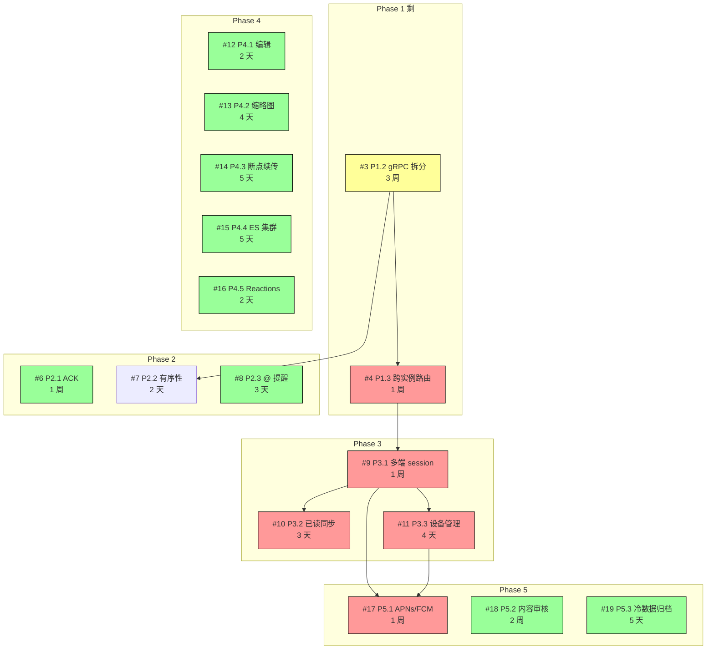

# Plan B 执行路线图 v1 · 剩余 15 任务

**作者**：chunluren
**日期**：2026-04-22
**版本**：v1.0
**状态**：Draft — 等批准后开工
**关联**：
- TDD 总文档（设计细节）：[2026-04-18-plan-b-mvp-sop.md](./2026-04-18-plan-b-mvp-sop.md)（3119 行 / 80 页 PDF）
- ACID 改进计划：[2026-04-17-acid-durability-improvements.md](./2026-04-17-acid-durability-improvements.md)
- GitHub Milestones：Phase 1-5

---

## 0. 文档定位

本文档是 **执行层路线图**，不是设计文档。设计细节请翻阅 `2026-04-18-plan-b-mvp-sop.md`。

### 关注点对比

| 维度 | TDD 总文档 | 本文档 |
|------|-----------|--------|
| 目的 | 写"该怎么做" | 写"什么时候做、按什么顺序做、做完怎么验收" |
| 内容 | 架构 / API / DB schema / 代码骨架 | 排期 / 依赖图 / 复盘 / kickoff checklist |
| 长度 | 3119 行 | ~1000 行 |
| 受众 | 开发执行人 | 项目管理 + 自我跟踪 |
| 更新频率 | 改动设计时更新 | **每完成一个任务更新一次** |

### 使用方式

1. 启动前读 §3 依赖图 + §6 排期 + §7 对应任务的 Kickoff Checklist
2. 完成后回到 §1 状态盘点更新进度
3. 出现风险事件时记录到 §8 风险登记册

---

## 1. 当前状态盘点（截至 2026-04-22）

### 1.1 总进度

```
Plan B 总任务: 17
已完成: 2 (12%)
待做:   15 (88%)
```

### 1.2 已完成

| # | 任务 | 完成日 | 实际工时 | 估时 | 偏差 |
|---|------|-------|---------|------|------|
| #2 [P1.1] | Snowflake ID | 2026-04-21 | ~3 天 | 3 天 | 0 |
| #5 [P1.4] | JWT jti + Redis 黑名单 | 2026-04-21 | ~2 天 | 2 天 | 0 |

加上**计划外的 recall bug 修复**（半天，commit `0aee39e`）。

### 1.3 待做（按 Phase）

| Phase | 数量 | 任务 |
|-------|------|------|
| Phase 1 基础设施 | 2 | #3 P1.2 gRPC 拆分、#4 P1.3 跨实例路由 |
| Phase 2 消息可靠性 | 3 | #6 P2.1 ACK、#7 P2.2 有序性、#8 P2.3 @ 提醒 |
| Phase 3 多端能力 | 3 | #9 P3.1 多端 session、#10 P3.2 已读同步、#11 P3.3 设备管理 |
| Phase 4 用户体验 | 5 | #12 P4.1 编辑、#13 P4.2 缩略图、#14 P4.3 断点续传、#15 P4.4 ES、#16 P4.5 Reactions |
| Phase 5 推送运营 | 3 | #17 P5.1 推送、#18 P5.2 审核、#19 P5.3 归档 |

### 1.4 仓库状态

- muduo-im main: `0aee39e`（Recall 修复）
- mymuduo-http main: `e281762`（Snowflake）
- 子模块对齐 ✓
- CI 绿灯 ✓
- 单测：19/19 + Snowflake 8/8 + JWT 9/9
- E2E：23/23（除 friend_request 数据污染问题）

---

## 2. 已完成任务复盘（Lessons Learned）

### 2.1 P1.1 Snowflake：教训

**问题**：Snowflake 改造时只改了后端 `ChatServer::generateServerMsgId()`，**没注意到前端 `web/index.html` 自己生成 UUID**。结果 DOM 上 msgId 是客户端 UUID，库里是 Snowflake，撤回直接挂。

**根因**：跨前后端的协议变更没做"协议影响面分析"。

**应对（已做）**：双 msgId 协议 + ack 透传（commit `0aee39e`）。

**教训沉淀到后续任务**：
1. **协议变更必须先做"协议影响面 checklist"**：列出所有协议字段使用方（后端 / 前端 / 第三方 SDK），每方都要有对应改动 + 测试用例
2. **回归测试要覆盖前端流程**：仅跑后端单测不够。Recall / Reply / Reaction 这类涉及 msgId 的功能要写真实 WebSocket 客户端 E2E。
3. **加协议版本号**：Plan B 后续任务都涉及协议变更（ACK / 多端 / 编辑 / Reactions），应在 WebSocket 握手协商一个 `protocol_version`，便于灰度。

**Action Item**：在 P2.1（客户端 ACK）启动前先做一次「协议契约文档化」——把所有 WS 消息类型 + 字段写入 `docs/PROTOCOL.md`。

### 2.2 P1.4 JWT jti：教训

**顺利之处**：纯后端改动，没碰前端，2 天准时完成。

**收获**：
- 双缓冲热更新模式能复用到 P5.2 词库管理
- Redis blacklist with TTL 是简单优雅的吊销方案
- `verifyAndParse` 返回完整 Claims 比单独返回 userId 更通用，后续多端 session（P3.1）可直接用 `claims.deviceId`

**Action Item**：P3.1 多端 session 启动前确认 JWT 加 device_id claim 的扩展是否需要再修一次 JwtService。

### 2.3 工时偏差为 0 的原因

两个任务**完全独立、不跨进程、不改前端**——所以估时准。**接下来跨前后端的任务（ACK / Reactions / 编辑）需要在原估时上 +30% 缓冲**。

---

## 3. 剩余任务依赖图



### 3.1 强依赖

| 任务 | 依赖 | 原因 |
|------|------|------|
| #4 P1.3 跨实例路由 | #3 P1.2 完成 | 没拆 Gateway/Logic 时所谓"跨实例"无意义 |
| #9 P3.1 多端 session | #3 P1.2 完成（推荐） | OnlineManager 重构在拆分后做更干净；不强依赖但建议 |
| #10 P3.2 已读同步 | #9 P3.1 完成 | 已读同步推送的目标是同一 uid 的"其他设备"，先要有多设备模型 |
| #11 P3.3 设备管理 | #9 P3.1 完成 | 设备管理表结构和多端 session 协议绑定 |
| #17 P5.1 APNs/FCM | #11 P3.3 完成 | 推送依赖 device token 注册 |

### 3.2 软依赖（建议但不强制）

| 任务 | 建议先做 | 原因 |
|------|---------|------|
| #7 P2.2 有序性强化 | #3 P1.2 | 有序性的前提是有多 Logic 实例；当前单进程"天然有序" |
| #19 P5.3 冷数据归档 | #6 P2.1 | ACK 完整后消息生命周期才完整，归档逻辑稳定 |

### 3.3 完全独立（任意时间可做）

- **#7 P2.2** 有序性（单实例下可先实现路由 hash 函数，多实例时直接用）
- **#8 P2.3** @ 提醒
- **#12 P4.1** 消息编辑
- **#13 P4.2** 图片缩略图
- **#14 P4.3** 断点续传
- **#15 P4.4** ES 集群
- **#16 P4.5** Reactions
- **#18 P5.2** 内容审核
- **#19 P5.3** 冷数据归档（建议在 ACK 后做）

**关键洞察**：**Phase 4 全部 5 个任务都是独立的**，可以"任何时段塞进来做"。

---

## 4. 三种执行路径

按"投入 / 收益 / 风险"三个维度提出 3 种执行路径，最后给推荐。

### 路径 A：稳健渐进（**推荐**）

**思想**：先做独立小任务建立节奏，再啃大块头。降低 burnout，每周都有产出。

**排期**：

| 周次 | 任务 | 累计完成 |
|------|------|---------|
| W1（W1） | #7 P2.2 有序性 + #8 P2.3 @ 提醒 | 2 + 2 = 4 |
| W2 | #12 P4.1 编辑 + #16 P4.5 Reactions | 4 + 2 = 6 |
| W3 | #6 P2.1 ACK | 6 + 1 = 7 |
| W4-W5 | #15 P4.4 ES 集群 + #14 P4.3 断点续传 | 7 + 2 = 9 |
| W6-W8 | **#3 P1.2 gRPC 拆分**（3 周） | 9 + 1 = 10 |
| W9 | #4 P1.3 跨实例路由 | 10 + 1 = 11 |
| W10 | #9 P3.1 多端 session | 11 + 1 = 12 |
| W11 | #10 P3.2 已读同步 + #11 P3.3 设备管理 | 12 + 2 = 14 |
| W12 | #13 P4.2 缩略图 | 14 + 1 = 15 |
| W13 | #17 P5.1 APNs/FCM | 15 + 1 = 16 |
| W14-W15 | **#18 P5.2 内容审核**（2 周） | 16 + 1 = 17 |

**优点**：
- 前 5 周持续产出，建立心流
- 大任务（gRPC 拆分）放中段，前期心态稳定后再啃
- 后期 P5 任务作为收官，能力积累已足够
- **15 周完成全部 15 任务**

**缺点**：
- 多端能力靠后，演示场景受限
- 推送等到 W13 才有，长 tail

### 路径 B：硬核优先（按 SOP 文档原顺序）

**思想**：严格按 Phase 1 → 2 → 3 → 4 → 5 顺序，先把分布式骨架打完。

**排期**：

| 周次 | 任务 |
|------|------|
| W1-W3 | **#3 P1.2 gRPC 拆分** |
| W4 | #4 P1.3 跨实例路由 |
| W5 | #6 P2.1 ACK |
| W5-W6 | #7 P2.2 + #8 P2.3 |
| W6-W7 | #9 P3.1 多端 session |
| W7-W8 | #10 P3.2 + #11 P3.3 |
| W9 | #12 P4.1 + #16 P4.5 |
| W10 | #13 P4.2 + #15 P4.4 |
| W11 | #14 P4.3 |
| W12 | #17 P5.1 |
| W13-W14 | #18 P5.2 |
| W15 | #19 P5.3 |

**优点**：
- 第 3 周末就有真正的多实例分布式架构
- 后续所有任务在分布式场景下设计 / 测试，避免单实例假设的技术债

**缺点**：
- **前 3 周没有任何小成就**，遇到问题易卡死
- gRPC 拆分一旦超期（30%+ 概率），整个排期连锁延迟
- 可能 W3 末尾才有第一个 PR 关闭

### 路径 C：演示驱动（业务功能优先）

**思想**：先把面试能 demo 的功能补齐（编辑 / Reactions / 缩略图 / 推送），分布式扔到最后。

**排期**：

| 周次 | 任务 |
|------|------|
| W1 | #12 P4.1 编辑 + #16 P4.5 Reactions |
| W2 | #8 P2.3 @ 提醒 + #13 P4.2 缩略图 |
| W3 | #14 P4.3 断点续传 |
| W4-W5 | #15 P4.4 ES + #6 P2.1 ACK |
| W6 | #11 P3.3 设备管理（绕过多端 session 提前做） |
| W7 | #17 P5.1 APNs/FCM |
| W8 | #7 P2.2 有序性 |
| W9-W11 | #3 P1.2 gRPC 拆分 |
| W12 | #4 P1.3 跨实例路由 |
| W13 | #9 P3.1 多端 session + #10 P3.2 |
| W14-W15 | #18 P5.2 + #19 P5.3 |

**优点**：
- 8 周内完成所有用户可见功能，演示丰富
- 适合短期面试 / 项目展示需求

**缺点**：
- 跳过了依赖关系，多端 session 等到 W13 才补，需返工微调
- 对学习"分布式系统"价值最低

### 推荐：**路径 A（稳健渐进）**

理由：
- 项目目的是面试材料 + 技术深度展示，不是上线产品
- 路径 A 的前 5 周能拿到 9 个 issue 关闭 = 持续可见的进度
- gRPC 拆分这种 3 周大块头放在 W6-W8（你已经热身完）成功率更高
- 即使 gRPC 拆分超期，前 5 周已有大量产出兜底

---

## 5. 重新估算的工时

基于 P1.1/P1.4 的实际经验，对剩余任务工时调整：

### 5.1 调整因子

| 因子 | 倍数 | 原因 |
|------|------|------|
| 跨前后端协议改动 | × 1.3 | Recall bug 教训，加 30% buffer |
| 跨进程 / 拆服务 | × 1.4 | gRPC 拆分高度复杂 |
| 涉及第三方账号 / 模型 | × 1.2 | APNs / FCM / NSFW 模型有外部依赖 |
| 单纯后端逻辑 | × 1.0 | 同 P1.1/P1.4 |

### 5.2 调整后工时

| # | 任务 | 原估 | 调整因子 | 调整后 |
|---|------|------|---------|--------|
| #3 P1.2 gRPC 拆分 | 3 周 | × 1.4 | **4 周** |
| #4 P1.3 跨实例路由 | 1 周 | × 1.4 | 1.5 周 |
| #6 P2.1 ACK | 1 周 | × 1.3 | 1.5 周 |
| #7 P2.2 有序性 | 2 天 | × 1.0 | 2 天 |
| #8 P2.3 @ 提醒 | 3 天 | × 1.3 | 4 天 |
| #9 P3.1 多端 session | 1 周 | × 1.3 | 1.5 周 |
| #10 P3.2 已读同步 | 3 天 | × 1.3 | 4 天 |
| #11 P3.3 设备管理 | 4 天 | × 1.0 | 4 天 |
| #12 P4.1 编辑 | 2 天 | × 1.3 | 3 天 |
| #13 P4.2 缩略图 | 4 天 | × 1.2 | 5 天 |
| #14 P4.3 断点续传 | 5 天 | × 1.3 | 7 天 |
| #15 P4.4 ES 集群 | 5 天 | × 1.0 | 5 天 |
| #16 P4.5 Reactions | 2 天 | × 1.3 | 3 天 |
| #17 P5.1 APNs/FCM | 1 周 | × 1.2 | 1.2 周 |
| #18 P5.2 内容审核 | 2 周 | × 1.2 | 2.5 周 |
| #19 P5.3 冷数据归档 | 5 天 | × 1.0 | 5 天 |

**总调整后工时：约 19 周**（原 16 周 + 3 周 buffer）

### 5.3 缓冲策略

每完成 3 个任务后留 1 天 buffer 用于：
- Bug 修复 / 回归测试
- 文档同步
- 下一阶段 kickoff 准备

15 任务总共约 5 个 buffer 日 ≈ 1 周。

**最终预算：20 周 = 5 个月专职**。如果按周末 + 每天 4 小时业余时间投入，约 7-8 个月。

---

## 6. 14 周排期方案（路径 A 详化）

### 月度总览

| 月 | 主题 | 关键任务 | 关闭数 |
|----|------|---------|--------|
| **M1** (W1-W4) | 业务功能补齐 + 协议契约 | #7 #8 #12 #16 #6 | 5 |
| **M2** (W5-W8) | ES 集群 + gRPC 拆分启动 | #15 #14 #3 | 2 |
| **M3** (W9-W12) | 分布式落地 + 多端 + 推送 | #4 #9 #10 #11 #13 | 5 |
| **M4** (W13-W15) | 推送 + 审核 + 归档 | #17 #18 #19 | 3 |

### 每周详细排期

#### 月 1：业务功能 + 协议契约

**W1**：协议契约 + 小任务起步
- D1: 写 `docs/PROTOCOL.md`（所有 WS 消息类型 + 字段，作为后续基础）
- D2-D3: **#7 P2.2 有序性强化**（路由 hash + 客户端排序）
- D4-D5: **#8 P2.3 @ 提醒**（DB migration + 解析 + 推送）

**W2**：UX 增强
- D1-D3: **#12 P4.1 消息编辑**（DB migration + 编辑窗口 + 前端 UI）
- D4-D5: **#16 P4.5 Reactions**（DB + API + 推送 + 前端）

**W3-W4**：消息可靠性
- W3 D1-D3: **#6 P2.1 ACK** 后端（双向 ack + Redis ZSET 超时追踪）
- W3 D4-W4 D2: **#6 P2.1 ACK** 前端（已送达 UI + 重试逻辑）
- W4 D3-D5: ACK E2E + 文档 + buffer

#### 月 2：搜索 + 重点骨架

**W5**：搜索能力
- D1-D2: **#15 P4.4 ES 3 节点集群 docker-compose** + IK 分词
- D3-D4: ES Client + MessageService::search 改 ES + 异步同步 worker
- D5: 降级测试 + 节点故障测试 + buffer

**W6-W8**：**#3 P1.2 gRPC 拆分**（4 周中 3 周，第 4 周到 W9）
- W6: protobuf 定义 + muduo-im-logic 独立二进制 + gRPC server
- W7: muduo-im-gateway 独立二进制 + gRPC client + bidirectional stream
- W8: 服务发现 + 一致性 hash LB + 多实例集成测试

#### 月 3：分布式落地 + 多端 + 推送

**W9**：完成拆分 + 跨实例
- W9 D1-D2: gRPC 拆分剩余（部署脚本 + Runbook + 性能压测）
- W9 D3-W10 D2: **#4 P1.3 跨实例路由**（Redis Pub/Sub）

**W10**：多端 session
- D3-D5 + W11 D1-D2: **#9 P3.1 多端 session**（OnlineManager 重构 + Redis HASH 升级 + WS 握手 + kick_device）

**W11**：多端协同
- D3-D4: **#10 P3.2 多端已读同步**
- D5 + W12 D1-D2: **#11 P3.3 设备管理 + APNs/FCM Token 注册**

**W12**：富媒体
- D3 起：**#13 P4.2 图片缩略图**（Python Worker + Pillow + Redis 队列）
- D4-D5 + W13 D1-D2: **#14 P4.3 断点续传**（init/chunk/status/complete 4 API + bitmap）

#### 月 4：推送与运营

**W13**：推送
- D3 起：**#17 P5.1 APNs / FCM 离线推送**
- 申请 Apple Developer + Firebase service account（前置 1-2 天等账号下来）
- HTTP/2 + p8 JWT 实现 APNs
- FCM REST 实现

**W14-W15**：审核与归档
- W14 全周 + W15 D1-D2: **#18 P5.2 自建内容审核**
  - W14: AC 自动机 + 词库 + 文字审核
  - W15: NSFW Python worker + pHash + 图片审核
- W15 D3-D5: **#19 P5.3 冷数据归档**
  - Python worker + Parquet + S3
  - archive_index 表 + 路由

### Buffer 分布

每月最后 1 天预留：
- **M1 末**：W4 D5（已含）
- **M2 末**：W8 D5
- **M3 末**：W12 D5
- **M4 末**：W15 D6（如超期）

---

## 7. 各任务 Kickoff Checklist

每个任务启动前过一遍这个 checklist，避免遗漏。

格式说明：
- **启动前必读**：开工前要先看的文件 / 章节
- **涉及文件**：需要修改 / 新增的文件清单
- **协议契约**：跨前后端 / 跨服务的接口约定
- **DoD（Definition of Done）**：完成的明确标准
- **回归测试**：必须通过的既有测试
- **关联**：原 TDD 章节 + GitHub issue

---

### #3 [P1.2] Gateway/Logic gRPC 拆分（4 周）

**启动前必读**
- TDD `§ 1.2`（80 页 PDF P12-19）+ 附录 G（gRPC 架构详解）
- mymuduo-http 的 `src/registry/`（这次终于用上了！）
- `src/server/ChatServer.h`（要拆的所有逻辑）

**涉及文件**
- 新增 `muduo-im/proto/logic.proto`（protobuf 定义）
- 新增 `muduo-im-logic/src/`（独立二进制）
- 新增 `muduo-im-gateway/src/`（独立二进制）
- 改 `muduo-im/CMakeLists.txt`（双二进制构建）
- 改 `docker-compose.yml`（多容器）

**协议契约（关键！）**
```protobuf
service LogicService {
    rpc HandleMessage(ClientMessage) returns (LogicResponse);
    rpc OnClientDisconnect(DisconnectEvent) returns (Ack);
}
service GatewayService {
    rpc PushToGateway(stream PushRequest) returns (stream PushAck);
}
```
**版本号**：proto 文件第一行加 `// version=v1`，未来变更时 bump。

**DoD**
- [ ] 2 Gateway + 2 Logic 容器互通
- [ ] kill 一个 Logic，Gateway 自动切到健康实例（< 30s）
- [ ] gRPC 单跳 P99 ≤ 5ms（用 ghz 压测）
- [ ] 既有 E2E 测试 23/23 全绿（在拆分后跑一遍）
- [ ] Runbook 写完（gRPC stream 断开 / Logic 全挂等场景）

**回归测试**
- 4 个 service 单测全绿
- E2E 23/23
- ACK / Recall / Reply 三个跨前后端流程必跑

**关联**
- GitHub: #3
- TDD: § 1.2（约 200 行设计） + 附录 G

---

### #4 [P1.3] 跨实例消息路由（1.5 周）

**前置依赖**：#3 完成

**启动前必读**
- TDD § 1.3
- `OnlineManager.h`（Redis key `online:{uid}` 数据结构改造）

**涉及文件**
- 新增 `muduo-im-gateway/src/InstanceRouter.h`
- 改 `OnlineManager`：`online:{uid}` 从 STRING 改 HASH `{device_id: instance_id}`
- 新增 Redis Pub/Sub 订阅独立线程

**协议契约**
- 频道名：`msg:instance:{INSTANCE_ID}`
- 消息序列化：用 protobuf（与 gRPC 复用）

**DoD**
- [ ] 3 实例环境下任意两实例消息互通
- [ ] 单实例挂掉，其他实例消息正常（3 次重试）
- [ ] 跨实例延迟 P99 < 20ms

**关联**
- GitHub: #4
- TDD: § 1.3

---

### #6 [P2.1] 客户端 ACK 双向回执（1.5 周）

**启动前必读**
- TDD § 2.1
- 复盘 P1.1 Recall bug → **必须先写 docs/PROTOCOL.md 把所有 msgId 流转梳理清楚**
- `MessageService.h`（要加 delivered_at 字段）

**涉及文件**
- DB migration：`private_messages.delivered_at TIMESTAMP NULL`
- 改 `MessageService::sendPrivate`（追踪 pending）
- 新增超时扫描后台线程
- 改 `web/index.html` ack 处理 + 已送达 UI

**协议契约**
```
{type:"msg",msgId,clientMsgId,from,to,body}            ← 已有
{type:"ack",msgId,clientMsgId}                          ← 已有（P1.1 修复后）
{type:"delivered",msgId,deliveredAt}                    ← 新增：服务端→发送方
{type:"client_ack",msgId}                               ← 新增：接收方→服务端
```

**DoD**
- [ ] 在线 A 给在线 B 发消息，A 在 1s 内收到 delivered
- [ ] B 离线时 A 不收 delivered；B 上线后 A 收到
- [ ] 端到端 P99 ≤ 1s
- [ ] WebSocket 流量放大不超过 2 倍（合并 ACK）

**关联**
- GitHub: #6
- TDD: § 2.1

---

### #7 [P2.2] 消息有序性强化（2 天）

**启动前必读**
- TDD § 2.2
- 当前 `handlePrivateMessage` 路由逻辑

**涉及文件**
- 新增 `routingKey()` 函数（hash by min/max uid）
- 改前端排序：按 msgId（Snowflake 已含时间戳）

**DoD**
- [ ] 单元测试：A 给 B 连续发 100 条，B 收到顺序严格 == 发送顺序
- [ ] 多 Logic 实例环境下（依赖 #3 #4）同会话路由到同实例

**关联**
- GitHub: #7
- TDD: § 2.2

---

### #8 [P2.3] @ 提醒（4 天）

**启动前必读**
- TDD § 2.3
- `group_messages` 表结构

**涉及文件**
- DB migration：`group_messages.mentions JSON`
- 改 `MessageService::sendGroup`（解析 mentions + 推送 mention=true）
- Redis：`unread_mentions:{uid}` HASH
- 改前端：@ 成员弹窗 + UI 高亮 + 未读区分

**协议契约**
```
{type:"group_msg",groupId,body,mentions:[uid1,uid2]}    ← 新增 mentions 字段
推送给被 @ 用户:
{type:"group_msg",...,mention:true}                     ← 标志位
```

**DoD**
- [ ] @ 对应用户收到 mention=true 的推送
- [ ] 未读 @ 计数独立于普通未读
- [ ] 离开群的用户不会被 @（前端弹窗过滤 + 后端校验）

**关联**
- GitHub: #8
- TDD: § 2.3

---

### #9 [P3.1] 多端 Session 模型（1.5 周）

**前置依赖**：#3 完成（推荐）

**启动前必读**
- TDD § 3.1
- `OnlineManager.h`（核心数据结构要重构）
- 复盘 P1.4 JWT：要补 device_id claim

**涉及文件**
- 改 `OnlineManager`：`uid → map<device_id, Session*>`
- 改 Redis：`online:{uid}` STRING → HASH `{device_id: instance_id}`
- 改 WS 握手：URL 加 `device_id` + `device_type`
- 改 `JwtService::generateWithJti`：payload 加 `deviceId`
- 新增管理端 `kick_device` 接口

**协议契约**
```
WS 握手:
  GET /ws?token=...&device_id=mobile-abc&device_type=ios

JWT payload 增加:
  {..., device: "mobile-abc"}

Redis:
  online:12345 = HASH {
    "mobile-abc": "instance-1",
    "pc-xyz": "instance-2"
  }
```

**DoD**
- [ ] 同 uid 登录 3 端都在线
- [ ] 推送 uid 时 3 端都收到
- [ ] kick 1 端，其他 2 端不受影响
- [ ] 最后 1 端下线后 isOnline 返回 false

**关联**
- GitHub: #9
- TDD: § 3.1

---

### #10 [P3.2] 多端已读同步（4 天）

**前置依赖**：#9 完成

**启动前必读**
- TDD § 3.2

**涉及文件**
- 改 `MessageService::handleRead`（广播 read_sync 给同 uid 其他 session）
- 改前端：处理 read_sync 消息

**协议契约**
```
{type:"read",convType:"private",convId:X,lastMsgId:Y}   ← 客户端上报
{type:"read_sync",convType,convId,lastMsgId}            ← 服务端→同 uid 其他端
```

**DoD**
- [ ] 手机端读消息，PC 端 1s 内未读清零
- [ ] 群消息已读人数不因多端重复 +N（去重）
- [ ] 风暴防护：1s 内多次 read_sync 合并

**关联**
- GitHub: #10
- TDD: § 3.2

---

### #11 [P3.3] 设备管理 + APNs/FCM Token 注册（4 天）

**前置依赖**：#9 完成

**启动前必读**
- TDD § 3.3

**涉及文件**
- DB migration：新表 `user_devices`
- 新增 `DeviceService.h`
- 新增 `POST /api/device/register` / `GET /api/user/devices` / `POST /api/device/logout`

**DoD**
- [ ] 新设备登录后 user_devices 有记录
- [ ] 30 天未活跃自动下线（cron 任务）
- [ ] 管理界面能列设备 + 主动下线

**关联**
- GitHub: #11
- TDD: § 3.3

---

### #12 [P4.1] 消息编辑（3 天）

**启动前必读**
- TDD § 4.1
- 复盘 P1.1：编辑也涉及 msgId 流转，先确认 PROTOCOL.md 完备

**涉及文件**
- DB migration：`private_messages.edited_at` + `original_body` + 新表 `message_edits`
- 改 `MessageService` 加 `edit()` 方法
- 改前端：编辑 UI + "已编辑"标识

**协议契约**
```
{type:"edit",msgId,newBody}                             ← 客户端→服务端
{type:"edit",msgId,newBody,editedAt}                    ← 推送给会话成员
```

**DoD**
- [ ] 15 分钟内可编辑成功
- [ ] 超过 15 分钟 API 返回 403
- [ ] 接收端实时显示新内容 + "已编辑"标识
- [ ] message_edits 表记录所有编辑历史

**关联**
- GitHub: #12
- TDD: § 4.1

---

### #13 [P4.2] 图片缩略图（5 天）

**启动前必读**
- TDD § 4.2
- 文件上传当前实现（`handleUpload`）

**涉及文件**
- 新增 `tools/thumb_worker/main.py`（Python + Pillow）
- 改 `docker-compose.yml`（加 thumb-worker 容器）
- 改 `MessageService` 上传后推 Redis 队列
- DB migration：`messages` 加 `file_thumb_200` / `file_thumb_600`
- 改前端：按尺寸加载

**协议契约**
- Redis 队列：`thumb_queue` LPUSH `{msg_id, original_path}`
- 完成后 worker 写 MySQL `file_thumb_200/600` 字段
- 不需要前后端协议改动（URL 多个字段而已）

**DoD**
- [ ] 上传图片 3 秒内 thumb 可用
- [ ] 缩略图压缩比 ~80%
- [ ] worker 挂时主流程不阻塞（消息仍能发送，仅缩略图失败）
- [ ] Redis 队列长度告警 > 1000 触发

**关联**
- GitHub: #13
- TDD: § 4.2

---

### #14 [P4.3] 断点续传（7 天）

**启动前必读**
- TDD § 4.3

**涉及文件**
- 4 个新 API：`/api/upload/init` / `chunk` / `status` / `complete`
- Redis：`upload:{upload_id}` HASH 维护分片状态（bitmap）
- 改前端：分片上传逻辑 + 断点恢复
- cron：清理超过 24h 未完成的 `/tmp/upload/*`

**DoD**
- [ ] 50MB 文件分片上传成功
- [ ] 模拟网络中断 10 次，每次恢复后从断点继续
- [ ] 24h 未完成的分片自动清理
- [ ] 性能：4 并发分片，吞吐 ≥ 50MB/s

**关联**
- GitHub: #14
- TDD: § 4.3

---

### #15 [P4.4] Elasticsearch 3 节点集群（5 天）

**启动前必读**
- TDD § 4.4
- 复习 ES 8 + IK 分词器配置

**涉及文件**
- 新增 `docker-compose.es.yml`（3 节点 ES）
- 新增 `tools/es_init/init_index.sh`
- 新增 `ESClient.h`（多节点连接池 + 故障切换）
- 改 `MessageService::search`（走 ES，降级 MySQL LIKE）
- 新增 `tools/es_sync_worker/main.py`（Redis queue → ES bulk index）

**DoD**
- [ ] 3 节点集群 docker-compose up 成功
- [ ] 10 万消息数据集 P99 搜索 < 200ms
- [ ] kill 1 节点集群仍可搜索（降级到 2 节点）
- [ ] ES 全挂时降级 MySQL LIKE，业务不中断
- [ ] IK 中文分词正确（含人名 / 业务名）

**关联**
- GitHub: #15
- TDD: § 4.4

---

### #16 [P4.5] 消息 Reactions（3 天）

**启动前必读**
- TDD § 4.5

**涉及文件**
- DB migration：`message_reactions(msg_id, uid, emoji)`
- 新增 `POST /api/message/react`
- 改前端：Reaction UI

**协议契约**
```
{type:"reaction",msgId,emoji}                           ← 客户端→服务端（切换）
{type:"reaction_update",msgId,reactions:{"👍":[uid1,uid2]}} ← 推送
```

**DoD**
- [ ] 点 👍 → 所有人看到
- [ ] 再点 → 取消
- [ ] 同一消息多种 emoji 共存

**关联**
- GitHub: #16
- TDD: § 4.5

---

### #17 [P5.1] APNs / FCM 离线推送（1.2 周）

**前置依赖**：#11 完成

**启动前必读**
- TDD § 5.1
- Apple Developer + Firebase 文档

**涉及文件**
- 新增 Apple Developer 账号申请 + p8 key 生成（运维任务）
- 新增 Firebase 项目 + service account JSON
- 新增 `tools/push_worker/`（独立 worker）
- 改 `MessageService` 离线时推 push_queue
- 配置：`config.ini` 加 `[push]` 段

**DoD**
- [ ] APNs 真机测试送达率 ≥ 95%
- [ ] FCM 真机测试送达率 ≥ 90%
- [ ] 推送延迟 P99 ≤ 10s
- [ ] 静默时段配置生效（22:00-08:00 不推送非紧急通知）
- [ ] token 失效自动清理 user_devices

**关联**
- GitHub: #17
- TDD: § 5.1

---

### #18 [P5.2] 自建内容审核（2.5 周）

**启动前必读**
- TDD § 5.2 + 附录 H（敏感词库规范）

**涉及文件**
- 新增 `src/moderation/AhoCorasick.h`
- 新增 `src/moderation/WordListManager.h`（双缓冲 + 60s 热更新）
- 新增 `src/moderation/ContentModerationService.h`
- 新增 `tools/nsfw_worker/`（Python + OpenNSFW2 + FastAPI）
- 新增 DB 表：`moderation_wordlist` / `moderation_logs`
- 改 `MessageService::sendPrivate/sendGroup` 集成审核

**DoD**
- [ ] 10 万词库 AC 自动机构建 < 3s
- [ ] 10KB 文本匹配 P99 < 1ms
- [ ] NSFW 准确率 ≥ 90%（测试集）
- [ ] 词库热更新 ≤ 60s 生效
- [ ] 审核 API 挂时降级（继续发送 + 标 review）
- [ ] 合规日志保留 180 天（block）/ 90 天（review）

**关联**
- GitHub: #18
- TDD: § 5.2 + 附录 H

---

### #19 [P5.3] 冷数据归档（5 天）

**启动前必读**
- TDD § 5.3

**涉及文件**
- 新增 `tools/archive_worker/main.py`（Python + pyarrow + boto3）
- 新增 DB 表：`archive_index`
- 改历史消息查询：先查 MySQL，不命中查 archive_index → S3
- cron：每天凌晨 2:00 归档

**DoD**
- [ ] 每天归档百万级消息 < 1 小时
- [ ] 90 天外消息查询延迟 P99 ≤ 2s
- [ ] S3 上传失败自动重试，3 次失败入失败队列
- [ ] 归档前先验证 S3 数据再删 MySQL（保留 7 天双份）

**关联**
- GitHub: #19
- TDD: § 5.3

---

## 8. 风险登记册（Risk Register）

### 8.1 已实现的风险
| 风险 | 阶段 | 后果 | 已采取行动 |
|------|------|------|-----------|
| 跨前后端协议不同步 | P1.1 | Recall 失败 | ✅ 修复 + 后续要先写 PROTOCOL.md |

### 8.2 进行中 / 未来风险

| ID | 风险 | 影响阶段 | 严重度 | 缓解 |
|----|------|---------|--------|------|
| R1 | gRPC 拆分超期 | #3 | 高 | 1. 4 周已加 30% buffer<br/>2. 设阶段里程碑（W6 完成 protobuf；W7 完成单边 Logic 跑通） |
| R2 | bidirectional stream 调试复杂 | #3 | 中 | grpc keepalive + 自动重连 + 日志埋点充分 |
| R3 | Redis Pub/Sub 单点 | #4 | 中 | Sentinel 部署 / 关键消息 MySQL 兜底 |
| R4 | OnlineManager 重构破坏既有功能 | #9 | 高 | E2E 测试要在每次小 commit 后跑一遍 |
| R5 | APNs/FCM 账号申请慢 | #17 | 中 | W12 末就开始申请，W13 才用 |
| R6 | NSFW 模型准确率低 | #18 | 中 | 准备好误判反馈机制 + 人工复审兜底 |
| R7 | S3 跨区延迟 | #19 | 低 | 选近区域；不影响主流程 |
| R8 | ES 内存爆炸 | #15 | 中 | JVM 堆 ≤ 4G + 监控告警 + bulk 写入限速 |
| R9 | 跨任务依赖断裂 | 全程 | 高 | 严格按依赖图；不跳过 |
| R10 | 累计 burnout | 全程 | 中 | 路径 A 设计就是为防止；每 4 周强制休息 1 周 |

### 8.3 红线（出现就停下重新评估）

- 任何一个任务超期 50%+ → 重新评估剩余排期
- 出现数据丢失 / 安全事件 → 立刻停下做 postmortem
- 超过 2 周没合 PR → 检查是不是路径选错

---

## 9. 协作 / 回滚约定

### 9.1 PR 流程

每个 issue 一个 feat/xxx 分支：
```
git checkout -b feat/p2-1-ack
# ... 开发 + 单测 ...
git commit -m "feat(phase-2.1): ..."
git push -u origin feat/p2-1-ack
# 在本地 self-review checklist (TDD § E)
# merge to main，关闭 issue
```

### 9.2 自审 checklist（每次合并前）

- [ ] 单测 ≥ 70% 覆盖新增代码
- [ ] 既有 19 + 8 + 9 单测全绿
- [ ] E2E 测试关键路径过一遍
- [ ] 文档同步（API.md / PROTOCOL.md / DATABASE.md）
- [ ] 监控指标埋点（Prometheus）
- [ ] 配置开关 `enable_xxx`（默认 false）

### 9.3 回滚矩阵

| 任务类型 | 回滚方式 | 耗时 |
|----------|----------|------|
| 纯后端修改 | 版本回滚 | 5 min |
| 涉及 DB migration | migration down + 版本回滚 | 30 min |
| gRPC 拆分（重） | 切回 monolithic 模式 | 10 min（需保留兼容） |
| 跨实例路由 | 配置开关 enable_cross_instance=false | 30s |
| 多端 session | DB rollback + OnlineManager 回滚 | 1 hour |
| 推送 / 审核 | 配置开关关闭 | 30s |

### 9.4 灰度策略

- 单实例时段：所有修改默认开启
- 多实例后：金丝雀 1 实例 → 50% → 100%

---

## 10. 终态目标

### 10.1 15 周后能力清单

技术：
- ✅ 多实例部署（Gateway + Logic 独立扩缩）
- ✅ 跨实例消息路由
- ✅ 多端登录 + 已读同步
- ✅ 完整消息可靠性（ACK + 撤回 + 编辑 + 引用 + Reactions）
- ✅ 离线推送（APNs + FCM）
- ✅ 内容审核（自建 AC 自动机 + NSFW 模型）
- ✅ ES 全文搜索
- ✅ 冷数据归档 S3
- ✅ 断点续传 50MB

工程：
- ✅ 全部 17 issue 关闭
- ✅ ~30+ 单元测试
- ✅ E2E 测试覆盖全流程
- ✅ 协议契约文档化（PROTOCOL.md）
- ✅ Runbook 完备（每个组件都有）
- ✅ Postmortem 模板（沉淀至少 3 个事故复盘）

### 10.2 演示场景

完成后能演示：
1. 单聊 / 群聊 / 撤回 / 编辑 / Reactions / @ 提醒
2. 多端同时登录，消息和已读同步
3. 离线时手机推送通知
4. 搜索历史消息
5. 上传 50MB 视频，断网恢复继续传
6. 内容违规自动拦截
7. **多实例部署**：kill 一个实例，业务无感知

### 10.3 可发布的副产物

- 完整 Plan B 实施过程的复盘文档
- 每个 Phase 一篇技术深度 blog
- 性能压测报告
- IM 系统设计参考（GitHub 公开）

---

## 11. 文档维护

**更新规则**：每完成一个 issue 必须更新本文档：
- §1.1 进度数字
- §1.2 已完成表（加一行）
- §2 复盘（如果有教训）
- §6 排期（如果有偏差）
- §8 风险登记册（如果新风险）

**变更日志**：

| 日期 | 版本 | 变更 |
|------|------|------|
| 2026-04-22 | v1.0 | 初版。基于 P1.1/P1.4 完成情况编写 |

---

**END**
